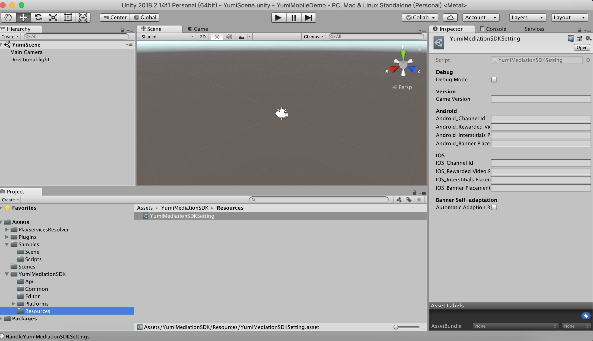

[TOC]

# YumiMediationSDK for Unity

## 概述

1.面向人群

本产品主要面向需要在 Unity 产品中接入玉米移动广告 SDK 的开发人员。

2.先决条件

- Unity 5.6 或更高版本


- 部署iOS

   Xcode 7.0 或更高版本

    iOS 8.0 或更高版本

    [CocoaPods](https://guides.cocoapods.org/using/getting-started.html)

- 部署Android

  Android SDK： > 4.4 (API level 19)

3.[Demo 获取地址](https://github.com/yumimobi/YumiMediationSDK-Unity)   

## 下载YumiMediationSDK Unity插件

Yumi聚合广告Unity插件使Unity开发人员可以轻松地在Android和iOS应用上展示广告，无需编写Java或Objective-C代码。该插件提供了一个C＃接口用于请求Unity项目中C＃脚本使用的广告。使用下面的链接下载插件的Unity包或在GitHub上查看其代码。

[下载YumiAdss Unity插件]()

[查看源码]()

## 导入YumiMediationSDK Unity插件

在Unity编辑器中打开您的项目。选择**Assets> Import Package> Custom Package**，找到您下载的YumiMediationSDKPlugin.unitypackage文件。


确保选中所有文件，然后单击 **Import**.


## 集成YumiMediationSDK

YumiMediationSDK Unity插件随着 [Unity Play Services Resolver library](https://github.com/googlesamples/unity-jar-resolver) 一起发布。该库主要供访问Android特定库（例如，AAR）或iOS CocoaPods的任何Unity插件使用。它为Unity插件提供了声明依赖关系的能力，然后自动解析并复制到Unity项目中。请按照下面列出的步骤确保您的项目包含Yumi移动广告SDK。

### 部署iOS项目

将YumiMediationSDK集成到Unity项目中无需其他步骤。

构建完成，打开**.xcworkspace**工程。

**注意：使用CocoaPods识别iOS依赖项。 CocoaPods作为后期构建过程步骤运行。**

### 部署Android项目

​	在Unity编辑器中，选择**Assets> Play Services Resolver> Android Resolver>Force Resolve**。 Unity Play服务解析器库会将声明的依赖项复制到Unity应用程序的Assets / Plugins / Android目录中。


注意： YumiMediationSDK Unity插件依赖项列在**Assets / YumiMediationSDK / Editor / YumiMobileAdsDependencies.xml**中

## 选择广告形式

在部署到Android或iOS平台时，YumiMediationSDK现在包含在Unity应用程序中。您现在已准备好实施广告。 YumiMediationSDK提供多种不同的广告格式，因此您可以选择最适合您的用户体验需求的广告格式。

### 设置YumiMediationSDK 广告位等信息

为了更好地帮助开发者填写广告信息，YumiMediationSDK 提供了图形化界面帮助开发者填写广告位等信息。

选择**Window>YumiMediationSDK>YumiMediationAd Settings**导入Unity项目


在 **Assets/YumiMediationSDK/Resources/YumiMediationSDKSetting.asset** 中输入您的广告位信息。



接口详情参考：**YumiMediationSDK.Common.YumiMediationSDKSetting**

### Banner

#### 初始化 Banner

```c#
using YumiMediationSDK.Api;
using YumiMediationSDK.Common;

public class YumiSDKDemo : MonoBehaviour
{

    private YumiBannerView bannerView;
    private string BannerPlacementId = "";
    private string GameVersionID = "";
    private String ChannelId = "";
    private bool IsSmartBanner;

    void Start()
    {
        //get ad info
        GameVersionID = YumiMediationSDKSetting.GetGameVersion;
        IsSmartBanner = YumiMediationSDKSetting.GetAutomaticAdaptionBanner;

        ChannelId = YumiMediationSDKSetting.ChannelId();
        BannerPlacementId = YumiMediationSDKSetting.BannerPlacementId();
    }
  
   private void InitBanner()
    {
        if (this.bannerView != null)
        {
            this.bannerView.Destroy();
        }

        this.bannerView = new YumiBannerView(BannerPlacementId, ChannelId, GameVersionID, YumiAdPosition.Bottom);

    }
}
```

#### 设置Banner事件

```c#
// banner add ad event
        this.bannerView.OnAdLoaded += this.HandleAdLoaded;
        this.bannerView.OnAdFailedToLoad += HandleAdFailedToLoad;
        this.bannerView.OnAdClick += HandleAdClicked;

```

```C#
  #region Banner callback handlers

    public void HandleAdLoaded(object sender, EventArgs args)
    {
        Logger.Log("HandleAdLoaded event received");
    }

    public void HandleAdFailedToLoad(object sender, YumiAdFailedToLoadEventArgs args)
    {
        Logger.Log("HandleFailedToReceiveAd event received with message: " + args.Message);
    }

    public void HandleAdClicked(object sender, EventArgs args)
    {
        Logger.Log("Handle Ad Clicked");
    }

    #endregion
```

#### 请求Banner

```C#
 this.bannerView.LoadAd(IsSmartBanner); //IsSmartBanner is true only support iOS
```

#### 隐藏Banner

```C#
this.bannerView.Hide();
```

#### 显示隐藏的Banner

```C#
this.bannerView.Show();
```

#### 销毁Banner

```C#
this.bannerView.Destroy();
```

### Interstitial

#### 初始化及请求插屏

```C#
using YumiMediationSDK.Api;
using YumiMediationSDK.Common;

public class YumiSDKDemo : MonoBehaviour
{
    private YumiInterstitialAd interstitialAd;
    private String InterstitialsPlacementId = "";
    private string GameVersionID = "";
    private String ChannelId = "";

    void Start()
    {
        //get ad info
        GameVersionID = YumiMediationSDKSetting.GetGameVersion;
        ChannelId = YumiMediationSDKSetting.ChannelId();
        InterstitialsPlacementId = YumiMediationSDKSetting.InterstitialPlacementId();
    }
 private void RequestInterstitial(){
        if (this.interstitialAd != null)
        {
            this.interstitialAd.DestroyInterstitial();
        }

        this.interstitialAd = new YumiInterstitialAd(InterstitialsPlacementId, ChannelId, GameVersionID);
    }
  
}
```

#### 设置Interstitial事件

```C#
  // add interstitial event 
            this.interstitialAd.OnAdLoaded += HandleInterstitialAdLoaded;
            this.interstitialAd.OnAdFailedToLoad += HandleInterstitialAdFailedToLoad;
            this.interstitialAd.OnAdClicked += HandleInterstitialAdClicked;
            this.interstitialAd.OnAdClosed += HandleInterstitialAdClosed;
```

```C#
  #region interstitial callback handlers

    public void HandleInterstitialAdLoaded(object sender, EventArgs args)
    {
        Logger.Log("HandleInterstitialAdLoaded event received");
    }

    public void HandleInterstitialAdFailedToLoad(object sender, YumiAdFailedToLoadEventArgs args)
    {
        Logger.Log("HandleInterstitialAdFailedToLoad event received with message: " + args.Message);
    }

    public void HandleInterstitialAdClicked(object sender, EventArgs args)
    {
        Logger.Log("HandleInterstitialAdClicked Clicked");
    }
    public void HandleInterstitialAdClosed(object sender, EventArgs args)
    {
        Logger.Log("HandleInterstitialAdClosed Ad closed");
    }

    #endregion
```

#### 展示Interstitial

建议先调用```this.interstitialAd.IsInterstitialReady()```判断插屏是否准备好

```C#
 if(this.interstitialAd.IsInterstitialReady()){
                this.interstitialAd.ShowInterstitial();
            }
```

#### 销毁Interstitial

```c#
this.interstitialAd.DestroyInterstitial();
```

### Rewarded Video

#### 初始化及请求视频

```C#
using YumiMediationSDK.Api;
using YumiMediationSDK.Common;

public class YumiSDKDemo : MonoBehaviour
{
    private YumiRewardVideoAd rewardVideoAd;

    private String RewardedVideoPlacementId = "";
    private string GameVersionID = "";
    private String ChannelId = "";

    void Start()
    {
        //get ad info
        GameVersionID = YumiMediationSDKSetting.GetGameVersion;
        ChannelId = YumiMediationSDKSetting.ChannelId();
        RewardedVideoPlacementId = YumiMediationSDKSetting.RewardVideoPlacementId();
    }
    private void RequestRewardVide(){
        if (this.rewardVideoAd != null)
        {
            this.rewardVideoAd.DestroyRewardVideo();
        }
        this.rewardVideoAd.LoadRewardVideoAd(RewardedVideoPlacementId, ChannelId, GameVersionID);
    }
}
```

#### 设置Rewarded Video 事件

```C#
 this.rewardVideoAd = new YumiRewardVideoAd();
        this.rewardVideoAd.OnAdOpening += HandleRewardVideoAdOpened;
        this.rewardVideoAd.OnAdStartPlaying += HandleRewardVideoAdStartPlaying;
        this.rewardVideoAd.OnAdRewarded += HandleRewardVideoAdReward;
        this.rewardVideoAd.OnAdClosed += HandleRewardVideoAdClosed;
```

```C#
 #region reward video callback handlers

    public void HandleRewardVideoAdOpened(object sender, EventArgs args)
    {
        Logger.Log("HandleRewardVideoAdOpened event opened");
    }

    public void HandleRewardVideoAdStartPlaying(object sender, EventArgs args)
    {
        Logger.Log("HandleRewardVideoAdStartPlaying event start playing ");
    }

    public void HandleRewardVideoAdReward(object sender, EventArgs args)
    {
        Logger.Log("HandleRewardVideoAdReward reward");
    }
    public void HandleRewardVideoAdClosed(object sender, EventArgs args)
    {
        Logger.Log("HandleRewardVideoAdClosed Ad closed");
    }

    #endregion
```

#### 判断视频是否准备好

```c#
 this.rewardVideoAd.IsRewardVideoReady();
```

#### 展示Rewarded Video

```c#
 if(this.rewardVideoAd.IsRewardVideoReady()){
                this.rewardVideoAd.PlayRewardVideo();
            }	
```

#### 销毁Rewarded Video

```c#
this.rewardVideoAd.DestroyRewardVideo();
```

## 调试模式

如果您想调试平台key是否有广告返回，可选择调试模式。 

### 调用调试模式

```C#
using YumiMediationSDK.Api;
using YumiMediationSDK.Common;

public class YumiSDKDemo : MonoBehaviour
{
   private YumiDebugCenter debugCenter;
  
   private void CallDebugCenter(){
        if (this.debugCenter == null)
        {
            this.debugCenter = new YumiDebugCenter();
        }

        this.debugCenter.PresentYumiMediationDebugCenter("your BannerPlacementId", "your InterstitialsPlacementId", "your RewardedVideoPlacementId", "your ChannelId", "your GameVersionID");
    }
}
```


