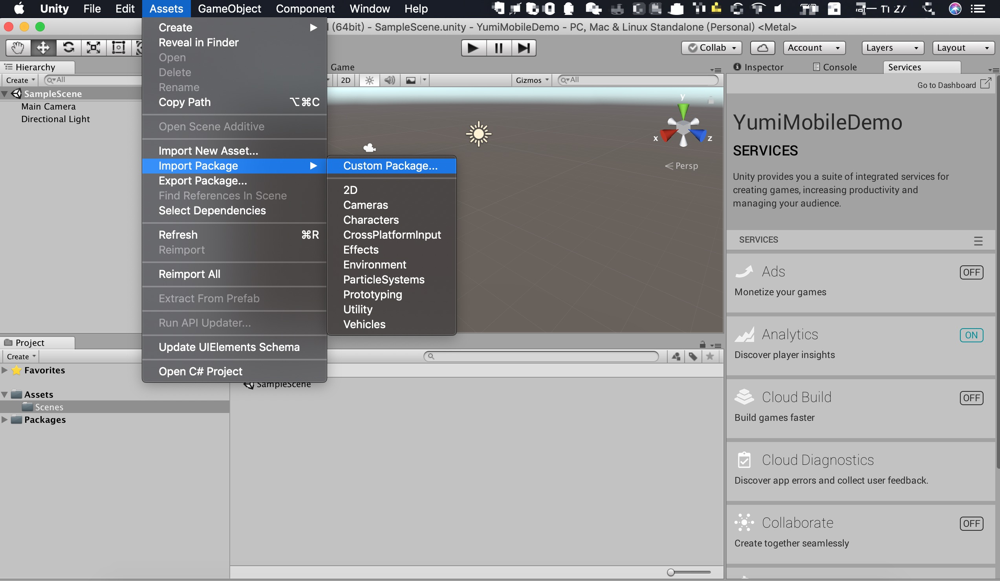
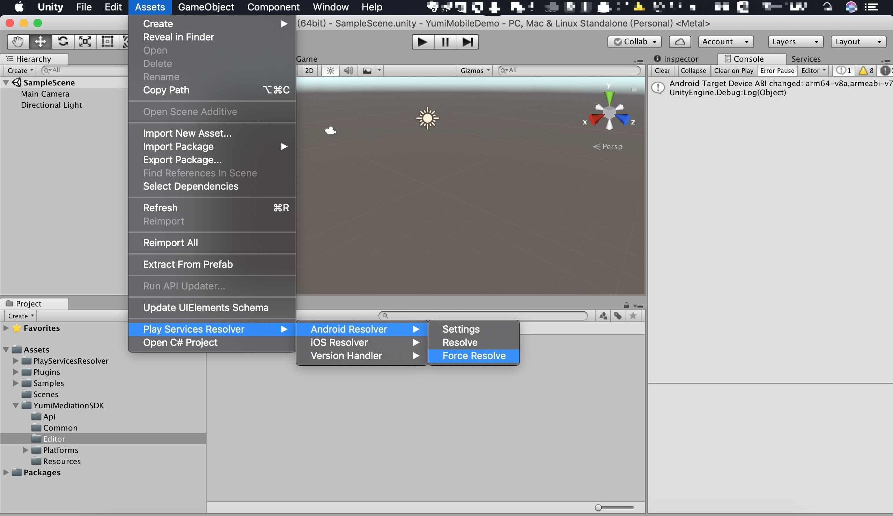
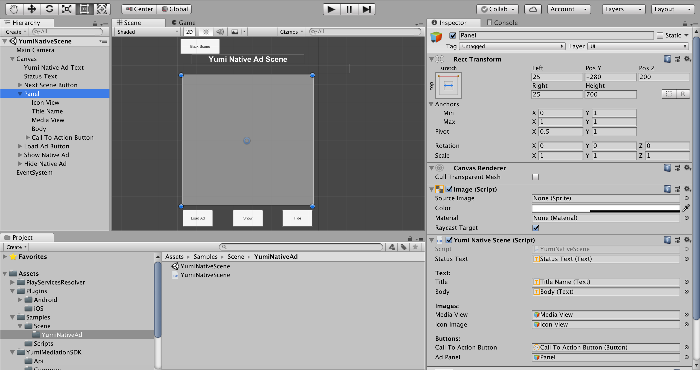
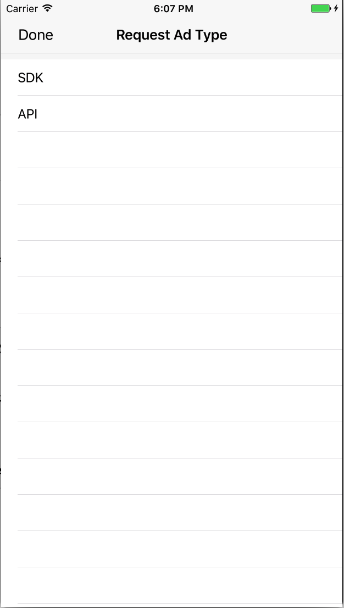
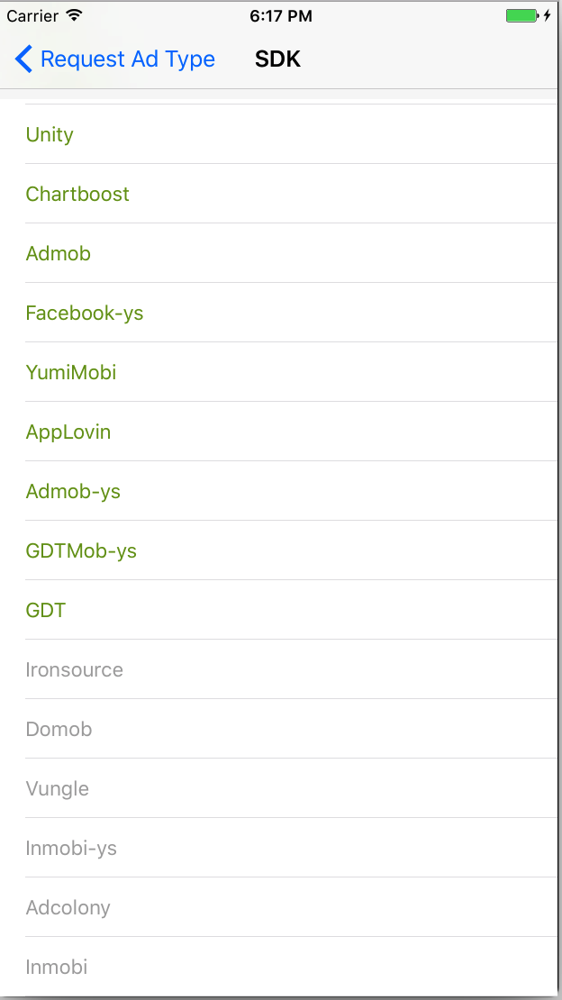
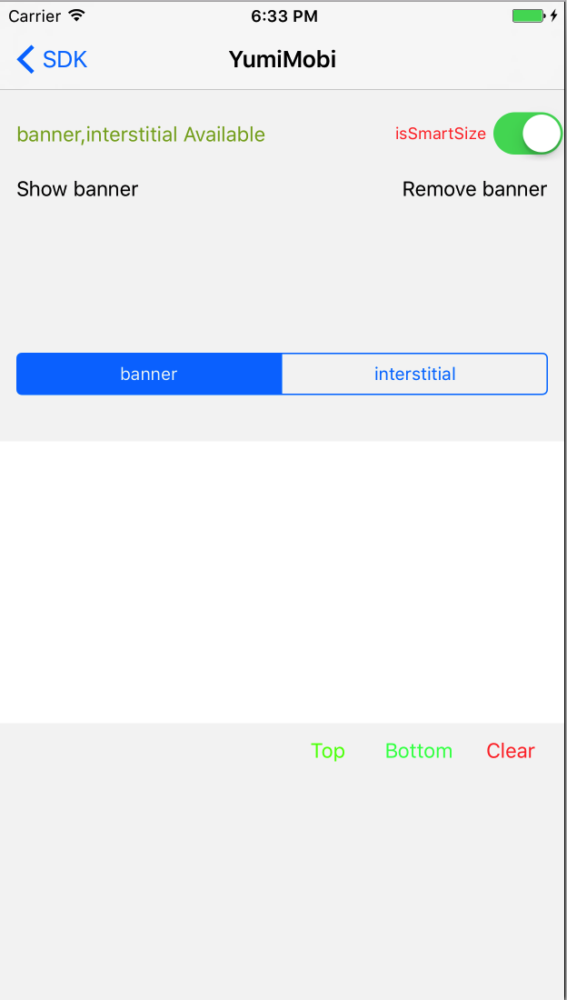

- [YumiMediationSDK for Unity](#yumimediationsdk-for-unity)
  - [1 概述](#1-%E6%A6%82%E8%BF%B0)
  - [2 下载 YumiMediationSDK Unity 插件](#2-%E4%B8%8B%E8%BD%BD-yumimediationsdk-unity-%E6%8F%92%E4%BB%B6)
  - [3 导入 YumiMediationSDK Unity 插件](#3-%E5%AF%BC%E5%85%A5-yumimediationsdk-unity-%E6%8F%92%E4%BB%B6)
    - [3.1 首次导入](#31-%E9%A6%96%E6%AC%A1%E5%AF%BC%E5%85%A5)
    - [3.2 升级插件](#32-%E5%8D%87%E7%BA%A7%E6%8F%92%E4%BB%B6)
  - [4 集成 YumiMediationSDK](#4-%E9%9B%86%E6%88%90-yumimediationsdk)
    - [4.1 部署 iOS 项目](#41-%E9%83%A8%E7%BD%B2-ios-%E9%A1%B9%E7%9B%AE)
    - [4.2 部署 Android 项目](#42-%E9%83%A8%E7%BD%B2-android-%E9%A1%B9%E7%9B%AE)
      - [4.2.1 常见问题一：加载三方 SDK 时间过长](#421-%E5%B8%B8%E8%A7%81%E9%97%AE%E9%A2%98%E4%B8%80%E5%8A%A0%E8%BD%BD%E4%B8%89%E6%96%B9-sdk-%E6%97%B6%E9%97%B4%E8%BF%87%E9%95%BF)
      - [4.2.2 常见问题二：64k 引用限制](#422-%E5%B8%B8%E8%A7%81%E9%97%AE%E9%A2%98%E4%BA%8C64k-%E5%BC%95%E7%94%A8%E9%99%90%E5%88%B6)
      - [4.2.3 常见问题三：设置 Admob MANAGER](#423-%E5%B8%B8%E8%A7%81%E9%97%AE%E9%A2%98%E4%B8%89%E8%AE%BE%E7%BD%AE-admob-manager)
  - [5 选择广告形式](#5-%E9%80%89%E6%8B%A9%E5%B9%BF%E5%91%8A%E5%BD%A2%E5%BC%8F)
    - [5.1 Banner](#51-banner)
      - [5.1.1 初始化 Banner](#511-%E5%88%9D%E5%A7%8B%E5%8C%96-banner)
      - [5.1.2请求 Banner](#512%E8%AF%B7%E6%B1%82-banner)
      - [5.1.3 隐藏 Banner](#513-%E9%9A%90%E8%97%8F-banner)
      - [5.1.4 显示隐藏的 Banner](#514-%E6%98%BE%E7%A4%BA%E9%9A%90%E8%97%8F%E7%9A%84-banner)
      - [5.1.5 销毁 Banner](#515-%E9%94%80%E6%AF%81-banner)
      - [5.1.6 YumiBannerViewOptions](#516-yumibannerviewoptions)
    - [5.2 Interstitial](#52-interstitial)
      - [5.2.1 初始化及请求插屏](#521-%E5%88%9D%E5%A7%8B%E5%8C%96%E5%8F%8A%E8%AF%B7%E6%B1%82%E6%8F%92%E5%B1%8F)
      - [5.2.2 展示 Interstitial](#522-%E5%B1%95%E7%A4%BA-interstitial)
      - [5.2.3 销毁 Interstitial](#523-%E9%94%80%E6%AF%81-interstitial)
    - [5.3 Rewarded Video](#53-rewarded-video)
      - [5.3.1 初始化及请求视频](#531-%E5%88%9D%E5%A7%8B%E5%8C%96%E5%8F%8A%E8%AF%B7%E6%B1%82%E8%A7%86%E9%A2%91)
      - [5.3.2 判断视频是否准备好](#532-%E5%88%A4%E6%96%AD%E8%A7%86%E9%A2%91%E6%98%AF%E5%90%A6%E5%87%86%E5%A4%87%E5%A5%BD)
      - [5.3.4 展示 Rewarded Video](#534-%E5%B1%95%E7%A4%BA-rewarded-video)
    - [5.4 Native](#54-native)
      - [5.4.1 初始化 Native](#541-%E5%88%9D%E5%A7%8B%E5%8C%96-native)
      - [5.4.2 YumiNativeAdOptions](#542-yuminativeadoptions)
      - [5.4.3 请求 Native](#543-%E8%AF%B7%E6%B1%82-native)
      - [5.4.4 创建原生广告布局](#544-%E5%88%9B%E5%BB%BA%E5%8E%9F%E7%94%9F%E5%B9%BF%E5%91%8A%E5%B8%83%E5%B1%80)
      - [5.4.5 使用广告元数据注册布局](#545-%E4%BD%BF%E7%94%A8%E5%B9%BF%E5%91%8A%E5%85%83%E6%95%B0%E6%8D%AE%E6%B3%A8%E5%86%8C%E5%B8%83%E5%B1%80)
      - [5.4.6 展示 Native View](#546-%E5%B1%95%E7%A4%BA-native-view)
      - [5.4.7 隐藏 Native View](#547-%E9%9A%90%E8%97%8F-native-view)
      - [5.4.8 移除 Native View](#548-%E7%A7%BB%E9%99%A4-native-view)
      - [5.4.9 销毁 Native](#549-%E9%94%80%E6%AF%81-native)
  - [6 调试模式](#6-%E8%B0%83%E8%AF%95%E6%A8%A1%E5%BC%8F)
    - [6.1 调用调试模式](#61-%E8%B0%83%E7%94%A8%E8%B0%83%E8%AF%95%E6%A8%A1%E5%BC%8F)
    - [6.2 图示](#62-%E5%9B%BE%E7%A4%BA)
  - [7 常见问题](#7-%E5%B8%B8%E8%A7%81%E9%97%AE%E9%A2%98)
    - [7.1 TEST ID](#71-test-id)
    - [7.2 Android 打包失败](#72-android-%E6%89%93%E5%8C%85%E5%A4%B1%E8%B4%A5)
      - [7.2.1 Failed to find Build Tools...](#721-failed-to-find-build-tools)
      - [7.2.2 No toolchains found...](#722-no-toolchains-found)
      - [7.2.3 Failed to apply plugin...](#723-failed-to-apply-plugin)
    - [7.3 android 9.0 适配](#73-android-90-%E9%80%82%E9%85%8D)

# YumiMediationSDK for Unity

## 1 概述

1. 面向人群

   本产品主要面向需要在 Unity 产品中接入玉米移动广告 SDK 的开发人员。

2. 先决条件

   - Unity 5.6 或更高版本

   - 部署 iOS
     
     Xcode 7.0 或更高版本
     
     iOS 8.0 或更高版本

     [CocoaPods](https://guides.cocoapods.org/using/getting-started.html)

   - 部署 Android

     Android SDK： > 4.1 (API level 16)

3. [Demo 获取地址](https://github.com/yumimobi/YumiMediationSDK-Unity)   

## 2 下载 YumiMediationSDK Unity 插件

Yumi 聚合广告 Unity 插件使 Unity 开发人员可以轻松地在 Android 和 iOS 应用上展示广告，无需编写 Java 或 Objective-C 代码。该插件提供了一个 C# 接口来请求广告。使用下面的链接下载插件的 Unity 包或在 GitHub 上查看其代码。

[下载YumiMediationSDK Unity插件](https://github.com/yumimobi/YumiMediationSDK-Unity/raw/master/YumiMediationSDKPlugin.unitypackage)

[查看源码](https://github.com/yumimobi/YumiMediationSDK-Unity)

## 3 导入 YumiMediationSDK Unity 插件
### 3.1 首次导入
在 Unity 编辑器中打开您的项目。选择**Assets> Import Package> Custom Package**，找到您下载的 YumiMediationSDKPlugin.unitypackage 文件。



确保选中所有文件，然后单击 **Import**.


### 3.2 升级插件
删除 Assets/YumiMediationSDK 目录，并按照 3.1 所述重新导入。

## 4 集成 YumiMediationSDK

YumiMediationSDK Unity 插件随着 [Unity Play Services Resolver library](https://github.com/googlesamples/unity-jar-resolver) 一起发布。这个库适用于任何需要访问 Android 特定库(例如 AARs )或 iOS CocoaPods 的 Unity 插件。它为 Unity 插件提供了声明依赖关系的能力，然后自动解析并复制到 Unity 项目中。请按照下面列出的步骤确保您的项目包含 YumiMediationSDK。

### 4.1 部署 iOS 项目

将 YumiMediationSDK 集成到 Unity 项目中无需其他步骤。

如果你想要修改 YumiMediationSDK 依赖的库，请修改 **Assets/YumiMediationSDK/Editor/YumiMobileAdsDependencies.xml**  文件，iOS 依赖如下：

```xml
    <iosPods>
        <iosPod name="YumiMediationSDK" version="3.6.3" minTargetSdk="8.0">
            <sources>
                <source>https://github.com/CocoaPods/Specs</source>
            </sources>
        </iosPod>
        <!-- adapters -->
        <iosPod name="YumiMediationAdapters/AdColony" version="3.6.3">
        </iosPod>
        <iosPod name="YumiMediationAdapters/AdMob" version="3.6.3">
        </iosPod>
        <iosPod name="YumiMediationAdapters/AppLovin" version="3.6.3">
        </iosPod>
        <iosPod name="YumiMediationAdapters/Baidu" version="3.6.3">
        </iosPod>
        <iosPod name="YumiMediationAdapters/Chartboost" version="3.6.3">
        </iosPod>
        <iosPod name="YumiMediationAdapters/Domob" version="3.6.3">
        </iosPod>
        <iosPod name="YumiMediationAdapters/Facebook" version="3.6.3">
        </iosPod>
        <iosPod name="YumiMediationAdapters/GDT" version="3.6.3">
        </iosPod>
        <iosPod name="YumiMediationAdapters/InMobi" version="3.6.3">
        </iosPod>
        <iosPod name="YumiMediationAdapters/IronSource" version="3.6.3">
        </iosPod>
        <iosPod name="YumiMediationAdapters/Unity" version="3.6.3">
        </iosPod>
        <iosPod name="YumiMediationAdapters/Vungle" version="3.6.3">
        </iosPod>
        <iosPod name="YumiMediationAdapters/Mintegral" version="3.6.3">
        </iosPod>
        <iosPod name="YumiMediationAdapters/OneWay" version="3.6.3">
        </iosPod>
        <iosPod name="YumiMediationAdapters/ZplayAds" version="3.6.3">
        </iosPod>
        <iosPod name="YumiMediationAdapters/IQzone" version="3.6.3">
        </iosPod>
        <!-- debugCenter -->
        <iosPod name="YumiMediationDebugCenter-iOS" version="3.6.3">
        </iosPod>
    </iosPods>
```

比如删除 `AdMob` ，直接删除 ` <iosPod name="YumiMediationAdapters/AdMob" version="3.6.3"></iosPod>`  即可。

构建完成，打开 **xcworkspace** 工程。

**注意：使用 CocoaPods 识别 iOS 依赖项。 CocoaPods 作为后期构建过程步骤运行。**
**注意: CocoaPods 会自动引用第三方 SDK，您无需手动添加。**

### 4.2 部署 Android 项目

在 Unity 编辑器中，选择 **Assets> Play Services Resolver> Android Resolver>Force Resolve**。 Unity Play 服务解析器库会将声明的依赖项复制到 Unity 应用程序的 **Assets/Plugins/Android** 目录中。



如果你想要修改 YumiMediationSDK 依赖的库，请修改 **Assets/YumiMediationSDK/Editor/YumiMobileAdsDependencies.xml**  文件，Android 依赖如下：

```xml
<androidPackages>
  <androidPackage spec="com.yumimobi.ads:mediation:3.6.1" />
  <androidPackage spec="com.yumimobi.ads.mediation:adcolony:3.6.1" />
  <androidPackage spec="com.yumimobi.ads.mediation:applovin:3.6.1" />
  <androidPackage spec="com.yumimobi.ads.mediation:playableads:3.6.1" />
  <androidPackage spec="com.yumimobi.ads.mediation:admob:3.6.1" />
  <androidPackage spec="com.yumimobi.ads.mediation:baidu:3.6.1" />
  <androidPackage spec="com.yumimobi.ads.mediation:chartboost:3.6.1" />
  <androidPackage spec="com.yumimobi.ads.mediation:facebook:3.6.1" />
  <androidPackage spec="com.yumimobi.ads.mediation:gdt:3.6.1" />
  <androidPackage spec="com.yumimobi.ads.mediation:inmobi:3.6.1" />
  <androidPackage spec="com.yumimobi.ads.mediation:oneway:3.6.1" />
  <androidPackage spec="com.yumimobi.ads.mediation:vungle:3.6.1" />
  <androidPackage spec="com.yumimobi.ads.mediation:ironsource:3.6.1" />
  <androidPackage spec="com.yumimobi.ads.mediation:iqzone:3.6.1">
      <repositories>
          <repository>https://dl.bintray.com/yumimobi/thirdparty/</repository>
          <repository>https://dl.bintray.com/yumimobi/ads/</repository>
          <repository>https://s3.amazonaws.com/moat-sdk-builds/</repository>
      </repositories>
  </androidPackage>

  <androidPackage spec="com.yumimobi.ads.mediation:ksyun:3.6.1" >
      <repositories>
          <repository>https://dl.bintray.com/yumimobi/thirdparty/</repository>
      </repositories>
  </androidPackage>
  <androidPackage spec="com.yumimobi.ads.mediation:mintegral:3.6.1" />
  <!--  If your app is only available in mainland China, use unity-china,else use Unity.   -->
  <androidPackage spec="com.yumimobi.ads.mediation:unity:3.6.1" />
  <!-- <androidPackage spec="com.yumimobi.ads.mediation:unity-china:3.6.1" />-->
  <repositories>
      <repository>https://jcenter.bintray.com/</repository>
      <repository>https://maven.google.com/</repository>
  </repositories>
</androidPackages>
```

比如删除 `admob`，直接删除 `<androidPackage spec="com.yumimobi.ads.mediation:admob:3.6.1" />` 即可。

**注意: Unity 插件会自动引用第三方广告 SDK，您无需手动添加。**

#### 4.2.1 常见问题一：加载三方 SDK 时间过长
执行 Android Resolver -> Resolve/Force resolve 时，插件会自动下载并导入相关 aar。如果添加多个平台，各平台依赖库版本不一致时插件会尝试自动解决依赖冲突，此过程可能耗时较长，请耐心等待。解决冲突时，尽量不要操作 Unity IDE，否则 Unity IDE 可能会出现卡死现象。

#### 4.2.2 常见问题二：64k 引用限制
添加过多三方 SDK 会导致 64k 引用限制问题，可以通过以下方式之一解决此问题：

解决方案一：查看 Unity 工程 Assets/Plugins/Android/ 下是否有 AndroidManifest.xml 与 mainTemplate.gradle 文件，若没有则复制此文件并添加到 Assets/Plugins/Android/ 目录下，文件地址：[AndroidManifest.xml](https://github.com/yumimobi/YumiMediationSDK-Unity/blob/master/Assets/Plugins/Android/AndroidManifest.xml)，[mainTemplate.gradle](https://github.com/yumimobi/YumiMediationSDK-Unity/blob/master/Assets/Plugins/Android/mainTemplate.gradle)；如果有这两个文件，则修改 AndroidManifest.xml 文件，如下：
```xml
<manifest>
  ...
  <application
      android:name="android.support.multidex.MultiDexApplication"
      ...
      >
      ...
  </application>
  ...
</manifest>
```
修改 mainTemplate.gradle 如下
```groovy
allprojects {
  repositories {
    google()
    jcenter()
    ...
  }
}
dependencies {
  ...
  implementation 'com.android.support:multidex:1.0.3'
  ...
**DEPS**}
```

解决方案二：将项目导出 Android Studio 工程，然后根据 [规避 64K 限制](https://developer.android.com/studio/build/multidex#avoid) 方案解决。

#### 4.2.3 常见问题三：设置 Admob MANAGER
通过在 AndroidManifest.xml 中添加以下 <meta-data> 标记，声明您的应用是 Ad Manager 应用。
```xml
<manifest>
    <application>
        <meta-data
            android:name="com.google.android.gms.ads.AD_MANAGER_APP"
            android:value="true"/>
    </application>
</manifest>
```
**重要提示**：自 Google 移动广告 SDK 17.0.0 版本开始，均须执行此步骤。如果未能添加此 <meta-data> 代码，将会导致崩溃，并显示以下消息："The Google Mobile Ads SDK was initialized incorrectly."

## 5 选择广告形式

在部署到 Android 或 iOS 平台时，YumiMediationSDK 现在包含在 Unity 应用程序中。您现在已准备好实施广告。YumiMediationSDK 提供多种不同的广告格式，因此您可以选择最适合您的用户体验需求的广告格式。

### 5.1 Banner

#### 5.1.1 初始化 Banner

```c#
using YumiMediationSDK.Api;
using YumiMediationSDK.Common;

public class YumiSDKDemo : MonoBehaviour
{
  private YumiBannerView bannerView;

  void Start()
  {
    this.InitBanner();
  }

  private void InitBanner()
  {
    string  gameVersionId = "YOUR_VERSION_ID";
    string  channelId = "YOUR_CHANNEL_ID";

    #if UNITY_ANDROID
      string bannerPlacementId = "YOUR_BANNER_PLACEMENT_ID_ANDROID";
    #elif UNITY_IOS
      string bannerPlacementId = "YOUR_BANNER_PLACEMENT_ID_IOS";
    #else
      string bannerPlacementId = "unexpected_platform";
    #endif
    
    // YumiBannerViewOptions 可以配置 Banner 位置、大小、是否自适应和是否自刷新
    YumiBannerViewOptions bannerOptions = new YumiBannerViewOptionsBuilder().Build();
    this.bannerView = new YumiBannerView(BannerPlacementId, ChannelId, GameVersionId, bannerOptions);

    /* banner add ad event */
    this.bannerView.OnAdLoaded    += HandleAdLoaded;
    this.bannerView.OnAdFailedToLoad  += HandleAdFailedToLoad;
    this.bannerView.OnAdClick   += HandleAdClicked;
  }

  #region Banner callback handlers

  public void HandleAdLoaded( object sender, EventArgs args )
  {
    Logger.Log( "HandleAdLoaded event received" );
  }

  public void HandleAdFailedToLoad( object sender, YumiAdFailedToLoadEventArgs args )
  {
    Logger.Log( "HandleFailedToReceiveAd event received with message: " + args.Message );
  }

  public void HandleAdClicked( object sender, EventArgs args )
  {
    Logger.Log( "Handle Ad Clicked" );
  }

  #endregion
}
```

#### 5.1.2请求 Banner

```C#
this.bannerView.LoadAd(); 
```

#### 5.1.3 隐藏 Banner

```C#
this.bannerView.Hide();
```

#### 5.1.4 显示隐藏的 Banner

```C#
this.bannerView.Show();
```

#### 5.1.5 销毁 Banner

```c#
this.bannerView.Destroy();
```
#### 5.1.6 YumiBannerViewOptions

`YumiBannerViewOptions` 是初始化 `YumiBannerView` 时传入的最后一个参数，您可在 `YumiBannerViewOptions` 文件中查看：

- `adPosition`

  设置 banner 广告位所处父视图的位置。默认为下方，居中显示。

- `bannerSize`

  设置 banner 广告的尺寸。

  在 iPhone 及 iPod Touch 上默认为 320 * 50。

  在 iPad 上默认为 728 * 90。

- `isSmart`

  默认为 true。

  如果设置为 true，banner 会自适应屏幕宽度。

  如果设置为 false，banner 会展示广告位自身尺寸。

- `disableAutoRefresh`

  默认为 false。
  
  如果设置为 false，banner 会自动请求下一条广告，您无需重复调用 `this.bannerView.LoadAd(); `。

  如果设置为 true，banner 不会进行下一次请求，您必须在恰当的时机再次调用 `this.bannerView.LoadAd();`。

默认创建 `YumiBannerViewOptions` 实例代码：
```C#
YumiBannerViewOptions bannerOptions = new YumiBannerViewOptionsBuilder().Build();
```

自定义创建 `YumiBannerViewOptions` 实例代码：
```C#
YumiBannerViewOptionsBuilder builder = new YumiBannerViewOptionsBuilder();
builder.setAdPosition(YumiAdPosition.TOP);
builder.setSmartState(false);
builder.setDisableAutoRefreshState(true);
builder.setBannerSize(YumiBannerAdSize.YUMI_BANNER_AD_SIZE_320x50);

YumiBannerViewOptions bannerOptions = new YumiBannerViewOptions(builder);
```

### 5.2 Interstitial

#### 5.2.1 初始化及请求插屏

插屏广告位会自动加载下一条广告，您无需重复调用
```C#
using YumiMediationSDK.Api;
using YumiMediationSDK.Common;
public class YumiSDKDemo : MonoBehaviour 
{
  private YumiInterstitialAd interstitialAd;
  void Start() 
  {
    this.RequestInterstitial();
  }
  private void RequestInterstitial() 
  {
    string gameVersionId = "YOUR_VERSION_ID";
    string channelId = "YOUR_CHANNEL_ID";
    #if UNITY_ANDROID
      string interstitialPlacementId = "YOUR_INTERSTITIAL_PLACEMENT_ID_ANDROID";
    #elif UNITY_IOS
      string interstitialPlacementId = "YOUR_INTERSTITIAL_PLACEMENT_ID_IOS";
    # else
      string interstitialPlacementId = "unexpected_platform";
    #endif
    this.interstitialAd = new YumiInterstitialAd(interstitialPlacementId, channelId, gameVersionId);

    // add interstitial event
    this.interstitialAd.OnAdLoaded += HandleInterstitialAdLoaded;
    this.interstitialAd.OnAdFailedToLoad += HandleInterstitialAdFailedToLoad;
    this.interstitialAd.OnAdClicked += HandleInterstitialAdClicked;
    this.interstitialAd.OnAdClosed += HandleInterstitialAdClosed;
  }
  
  #region interstitial callback handlers
  public void HandleInterstitialAdLoaded(object sender, EventArgs args) 
  {
    Logger.Log("HandleInterstitialAdLoaded event received");
  }
  public void HandleInterstitialAdFailedToLoad(object sender, YumiAdFailedToLoadEventArgs args) 
  {
    Logger.Log("HandleInterstitialAdFailedToLoad event received with message: " + args.Message);
  }
  public void HandleInterstitialAdClicked(object sender, EventArgs args) 
  {
    Logger.Log("HandleInterstitialAdClicked Clicked");
  }
  public void HandleInterstitialAdClosed(object sender, EventArgs args) 
  {
    Logger.Log("HandleInterstitialAdClosed Ad closed");
  }
  #endregion
}
```

#### 5.2.2 展示 Interstitial

建议先调用 `this.interstitialAd.IsReady()` 判断插屏是否准备好

```C#
 if(this.interstitialAd.IsReady())
 {
  this.interstitialAd.Show();
 }
```

#### 5.2.3 销毁 Interstitial

```c#
this.interstitialAd.Destroy();
```

### 5.3 Rewarded Video

#### 5.3.1 初始化及请求视频

视频广告位会自动加载下一条广告，您无需重复调用。
```C#
using YumiMediationSDK.Api;
using YumiMediationSDK.Common;
public class YumiSDKDemo : MonoBehaviour 
{
  private YumiRewardVideoAd rewardVideoAd;
  void Start() 
  {
    this.RequestRewardVideo();
  }
  private void RequestRewardVideo() 
  {
    string gameVersionId = "YOUR_VERSION_ID";
    string channelId = "YOUR_CHANNEL_ID";
    #if UNITY_ANDROID
      string rewardVideoPlacementId = "YOUR_REWARDVIDEO_PLACEMENT_ID_ANDROID";
    #elif UNITY_IOS
      string rewardVideoPlacementId = "YOUR_REWARDVIDEO_PLACEMENT_ID_IOS";
    # else
      string rewardVideoPlacementId = "unexpected_platform";
    #endif
    this.rewardVideoAd = YumiRewardVideoAd.Instance;
    this.rewardVideoAd.OnAdOpening += HandleRewardVideoAdOpened;
    this.rewardVideoAd.OnAdStartPlaying += HandleRewardVideoAdStartPlaying;
    this.rewardVideoAd.OnAdRewarded += HandleRewardVideoAdReward;
    this.rewardVideoAd.OnAdClosed += HandleRewardVideoAdClosed;
    // load ad
    this.rewardVideoAd.LoadAd(rewardVideoPlacementId, channelId, gameVersionId);
  }
  
  #region reward video callback handlers
  public void HandleRewardVideoAdOpened(object sender, EventArgs args) 
  {
    Logger.Log("HandleRewardVideoAdOpened event opened");
  }
  public void HandleRewardVideoAdStartPlaying(object sender, EventArgs args) 
  {
    Logger.Log("HandleRewardVideoAdStartPlaying event start playing ");
  }
  public void HandleRewardVideoAdReward(object sender, EventArgs args) 
  {
    Logger.Log("HandleRewardVideoAdReward reward");
  }
  public void HandleRewardVideoAdClosed(object sender, EventArgs args) 
  {
    Logger.Log("HandleRewardVideoAdClosed Ad closed");
  }
  #endregion
}
```

#### 5.3.2 判断视频是否准备好

```c#
 this.rewardVideoAd.IsReady();
```

#### 5.3.4 展示 Rewarded Video

```c#
 if(this.rewardVideoAd.IsReady())
 {
  this.rewardVideoAd.Play();
 } 
```

### 5.4 Native

#### 5.4.1 初始化 Native

```c#
using UnityEngine;
using UnityEngine.UI;
using System;
using System.Collections;
using System.Collections.Generic;
using UnityEngine.SceneManagement;
using YumiMediationSDK.Api;
using YumiMediationSDK.Common;

public class YumiNativeScene : MonoBehaviour
{
    private YumiNativeAd nativeAd;
    private YumiNativeData yumiNativeData;
    // UI elements in scene
    [Header("Text:")]
    public Text title;
    public Text body;
    [Header("Images:")]
    public GameObject mediaView;
    public GameObject iconImage;
    [Header("Buttons:")]
    // This doesn't be a button - it can also be an image
    public Button callToActionButton;

    // ad panel
    public GameObject adPanel;
  
    void Start()
    {
        this.InitNativeAd();
    }
    private void InitNativeAd()
    {
        string gameVersionId = "YOUR_VERSION_ID";
        string channelId = "YOUR_CHANNEL_ID";
        #if UNITY_ANDROID
          string nativePlacementId = "YOUR_NATIVE_PLACEMENT_ID_ANDROID";
        #elif UNITY_IOS
          string nativePlacementId = "YOUR_NATIVE_PLACEMENT_ID_IOS";
        #else
          string nativePlacementId = "unexpected_platform";
        #endif
        YumiNativeAdOptions options = new NativeAdOptionsBuilder().Build();
        this.nativeAd = new YumiNativeAd(nativePlacementId, channelId, gameVersionId, options);
        // callBack
        this.nativeAd.OnNativeAdLoaded += HandleNativeAdLoaded;
        this.nativeAd.OnAdFailedToLoad += HandleNativeAdFailedToLoad;
        this.nativeAd.OnAdClick += HandleNativeAdClicked;
    }
    #region native call back handles
    public void HandleNativeAdLoaded(object sender, YumiNativeToLoadEventArgs args)
    {
        Logger.Log("HandleNativeAdLoaded event opened");
        if (nativeAd == null)
        {
            Logger.Log("nativeAd is null");
            return;
        }

        if (args == null || args.nativeData == null || args.nativeData.Count == 0)
        {
            Logger.Log("nativeAd data not found.");
            return;
        }
        // args.nativeData is nativeAd data
      	yumiNativeData = args.nativeData[0];
    }
    public void HandleNativeAdFailedToLoad(object sender, YumiAdFailedToLoadEventArgs args)
    {
        Logger.Log("HandleNativeAdFailedToLoad event received with message: " + args.Message);
    }
    public void HandleNativeAdClicked(object sender, EventArgs args)
    {
        Logger.Log("HandleNativeAdClicked");
    }

    #endregion
}
```

#### 5.4.2 YumiNativeAdOptions

`YumiNativeAdOptions` 是初始化 `YumiNativeAd` 的最后一个参数，可以配置原生广告显示的样式，参数详情如下：

```c#
// AdOptionViewPosition: TOP_LEFT,TOP_RIGHT,BOTTOM_LEFT,BOTTOM_RIGHT
internal AdOptionViewPosition adChoiseViewPosition;
// AdAttribution: AdOptionsPosition、text、textColor、backgroundColor、textSize、hide
internal AdAttribution adAttribution;
// TextOptions: textSize，textColor，backgroundColor
internal TextOptions titleTextOptions;
internal TextOptions descTextOptions;
internal TextOptions callToActionTextOptions;
// ScaleType: SCALE_TO_FILL、SCALE_ASPECT_FIT、SCALE_ASPECT_FILL
internal ScaleType iconScaleType;
internal ScaleType coverImageScaleType;
```

#### 5.4.3 请求 Native

```c#
int adCount = 1;// adCount: you can load more than one ad
this.nativeAd.LoadAd(adCount);
```

#### 5.4.4 创建原生广告布局

```c#
public class YumiNativeScene : MonoBehaviour
  {
    private YumiNativeAd nativeAd;
    // UI elements in scene
    [Header("Text:")]
    public Text title;
    public Text body;
    [Header("Images:")]
    public GameObject mediaView;
    public GameObject iconImage;
    [Header("Buttons:")]
    // This doesn't be a button - it can also be an image
    public Button callToActionButton;
  	/// ...
  }

```

以下说明这些元素如何与编辑器中的视图关联：



#### 5.4.5 使用广告元数据注册布局

```C#
public class YumiNativeScene : MonoBehaviour
{
  private YumiNativeAd nativeAd;
  private YumiNativeData yumiNativeData;
  private void RegisterNativeViews()
    {
        Dictionary<NativeElemetType, Transform> elementsDictionary = new Dictionary<NativeElemetType, Transform>();
        elementsDictionary.Add(NativeElemetType.PANEL, adPanel.transform);
        elementsDictionary.Add(NativeElemetType.TITLE, title.transform);
        elementsDictionary.Add(NativeElemetType.DESCRIPTION, body.transform);
        elementsDictionary.Add(NativeElemetType.ICON, iconImage.transform);
        elementsDictionary.Add(NativeElemetType.COVER_IMAGE, mediaView.transform);
        elementsDictionary.Add(NativeElemetType.CALL_TO_ACTION, callToActionButton.transform);
        // This is a method to associate a YumiNativeData with the ad assets gameobject you will use to display the native ads.
        this.nativeAd.RegisterGameObjectsForInteraction(yumiNativeData, gameObject, elementsDictionary);

    }
}
```

#### 5.4.6 展示 Native View

```C#
// Determines whether nativeAd data is invalidated, if invalidated please reload
if (this.nativeAd.IsAdInvalidated(yumiNativeData))
  {
      Logger.Log("Native Data is invalidated");
      return;
  }
  this.nativeAd.ShowView(yumiNativeData);
```

- 注意：显示广告前，您必须注册布局并检查广告是否已经无效。

#### 5.4.7 隐藏 Native View

```c#
this.nativeAd.HideView(yumiNativeData);// Hide nativeAd data associate view 
```

#### 5.4.8 移除 Native View

```c#
this.nativeAd.UnregisterView(yumiNativeData);
```

此方法的作用：从屏幕上移除当前广告视图，断开 View 和 广告元数据的注册。在显示一个新广告时，请先调用这个方法。

#### 5.4.9 销毁 Native

```c#
this.nativeAd.Destroy();
```

## 6 调试模式

如果您想调试平台 key 是否有广告返回，可选择调试模式。 

### 6.1 调用调试模式

```C#
using YumiMediationSDK.Api;
using YumiMediationSDK.Common;

public class YumiSDKDemo : MonoBehaviour
{
   private YumiDebugCenter debugCenter;
  
   private void CallDebugCenter(){
        if (this.debugCenter == null)
        {
            this.debugCenter = new YumiDebugCenter();
        }
        // 注意：填写的广告位信息要区分iOS和Android
        this.debugCenter.PresentYumiMediationDebugCenter("YOUR_BANNER_PLACEMENT_ID", "YOUR_INTERSTITIAL_PLACEMENT_ID", "YOUR_REWARDVIDEO_PLACEMENT_ID", "YOUR_NATIVE_PLACEMENT_ID","YOUR_CHANNEL_ID", "YOUR_VERSION_ID");
    }
}
```

### 6.2 图示

以 iOS 平台为例（Android 平台逻辑相同，UI 不同）。

<div align="center"></div>

*<p align="center" size=1>选择平台类型</p>*

<div align="center"></div>

*<p align="center" size=1>选择单一平台进行调试<br>如果您需要的平台未在列表中，则代表此平台未添加至工程中<br>绿色平台为已添加至工程并且已配置<br>灰色平台为已添加至工程但未配置</p>*

<div align="center"></div>

*<p align="center" size=1>选择广告类型，调试单一平台</p>*

## 7 常见问题

### 7.1 TEST ID
 

| 系统    | 广告类型       | Slot(Placement) ID | 备注                                                                                                                                       |
| ------- | -------------- | ------------------ | ------------------------------------------------------------------------------------------------------------------------------------------ |
| Android | Banner         | uz852t89           | YUMI,AdMob,APPlovin,Baidu,IQzone 使用此test id,以上Network平台可测试到对应平台广告                                                         |
| Android | Interstitial   | 56ubk22h           | YUMI,AdMob,APPlovin,Baidu,IronSource,Inmobi,IQzone, untiy Ads，vungle, ZPLAYAds 使用此test id,以上Network平台可测试到对应平台广告          |
| Android | Rewarded Video | ew9hyvl4           | YUMI,AdMob,APPlovin,GDTMob,IronSource,Inmobi,IQzone, untiy Ads，vungle, ZPLAYAds 使用此test id,以上Network平台可测试到对应平台广告         |
| Android | Native         | dt62rndy           | YUMI,AdMob,Baidu,GDTMob,Facebook 使用此test id,以上Network平台可测试到对应平台广告                                                         |
| iOS     | Banner         | l6ibkpae           | YUMI,AdMob,APPlovin,Baidu,Facebook,GDTMob  使用此test id,以上Network平台可测试到对应平台广告                                               |
| iOS     | Interstitial   | onkkeg5i           | YUMI,AdMob,Baidu,Chartboost,GDTMob,IronSource,Inmobi,IQzone, untiy Ads，vungle, ZPLAYAds 使用此test id,以上Network平台可测试到对应平台广告 |
| iOS     | Rewarded Video | 5xmpgti4           | YUMI,AdMob,Adcolony, APPlovin,IronSource,Inmobi,Mintegral, untiy Ads，vungle, ZPLAYAds 使用此test id,以上Network平台可测试到对应平台广告   |
| iOS     | Native         | atb3ke1i           | YUMI,AdMob,Baidu,GDTMob,Facebook 使用此test id,以上Network平台可测试到对应平台广告                                                         |


### 7.2 Android 打包失败
#### 7.2.1 Failed to find Build Tools...
```
* What went wrong:
A problem occurred configuring root project 'gradleOut'.
> Failed to find Build Tools revision 29.0.0
```

**解决方法**

从 [mainTemplet](../../Assets/Plugins/Android/mainTemplate.gradle) 中删除 `buildToolsVersion '**BUILDTOOLS**'` 

#### 7.2.2 No toolchains found...
```
* What went wrong:
A problem occurred configuring root project 'gradleOut'.
> No toolchains found in the NDK toolchains folder for ABI with prefix: mips64el-linux-android
```

**解决方法**

修改 [mainTemplet](../../Assets/Plugins/Android/mainTemplate.gradle) 中 gradle plugin 版本，如将 `classpath 'com.android.tools.build:gradle:3.0.1'` 修改为 `classpath 'com.android.tools.build:gradle:3.2.1'`。

#### 7.2.3 Failed to apply plugin...
```
* What went wrong:
A problem occurred evaluating root project 'gradleOut'.
> Failed to apply plugin [id 'com.android.application']
   > Minimum supported Gradle version is 4.6. Current version is 4.2.1. If using the gradle wrapper, try editing the distributionUrl in
```

**解决方法（以下方法任选一个即可）**

1. 升级 gradle 版本至 4.6
2. 降级 gradle plugin 版本至 gradle 4.2.1 对应的版本。对照 [Update Gradle](https://developer.android.com/studio/releases/gradle-plugin#updating-gradle) 文档可知需要将 [mainTemplet](../../Assets/Plugins/Android/mainTemplate.gradle) 中 `classpath 'com.android.tools.build:gradle:x.x.x'` 修改为 `classpath 'com.android.tools.build:gradle:3.0.0+'`

### 7.3 android 9.0 适配
Mintegral Android SDK 暂不支持 Android 9.0 及以上操作系统，如果在 Android 9.0 系统出现的崩溃，可以通过将 targetSdkVersion 设置为 27 或删除 Mintegral 平台来解决该问题。