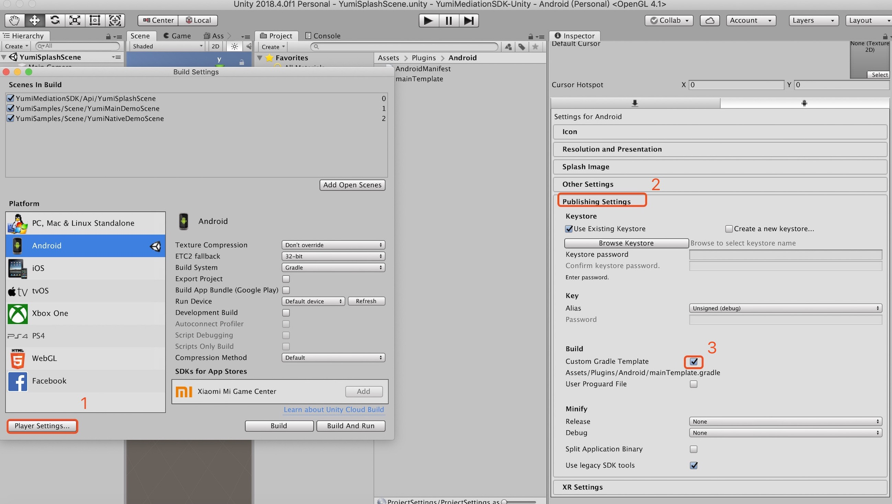
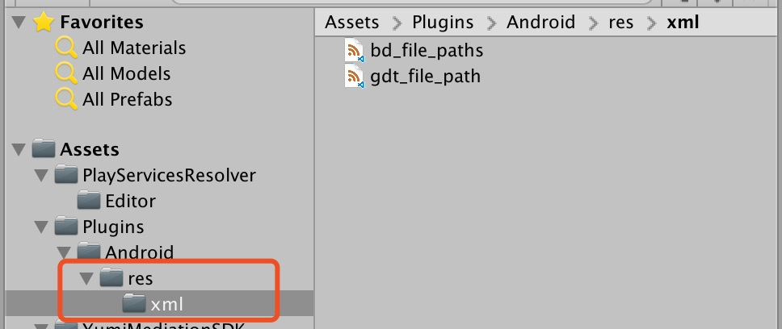

   * [YumiMediationSDK for Unity](#yumimediationsdk-for-unity)
      * [1 概述](#1-概述)
      * [2 下载 YumiMediationSDK Unity 插件](#2-下载-yumimediationsdk-unity-插件)
      * [3 导入 YumiMediationSDK Unity 插件](#3-导入-yumimediationsdk-unity-插件)
         * [3.1 首次导入](#31-首次导入)
         * [3.2 升级插件](#32-升级插件)
      * [4 集成 YumiMediationSDK](#4-集成-yumimediationsdk)
         * [4.1 部署 iOS 项目](#41-部署-ios-项目)
         * [4.2 部署 Android 项目](#42-部署-android-项目)
      * [5 选择广告形式](#5-选择广告形式)
         * [5.1 Banner](#51-banner)
            * [5.1.1 初始化 Banner](#511-初始化-banner)
            * [5.1.2请求 Banner](#512请求-banner)
            * [5.1.3 隐藏 Banner](#513-隐藏-banner)
            * [5.1.4 显示隐藏的 Banner](#514-显示隐藏的-banner)
            * [5.1.5 销毁 Banner](#515-销毁-banner)
            * [5.1.6 YumiBannerViewOptions](#516-yumibannerviewoptions)
         * [5.2 Interstitial](#52-interstitial)
            * [5.2.1 初始化及请求插屏](#521-初始化及请求插屏)
            * [5.2.2 展示 Interstitial](#522-展示-interstitial)
            * [5.2.3 销毁 Interstitial](#523-销毁-interstitial)
         * [5.3 Rewarded Video](#53-rewarded-video)
            * [5.3.1 初始化及请求视频](#531-初始化及请求视频)
            * [5.3.2 判断视频是否准备好](#532-判断视频是否准备好)
            * [5.3.4 展示 Rewarded Video](#534-展示-rewarded-video)
         * [5.4 Native](#54-native)
            * [5.4.1 初始化 Native](#541-初始化-native)
            * [5.4.2 YumiNativeAdOptions](#542-yuminativeadoptions)
            * [5.4.3 请求 Native](#543-请求-native)
            * [5.4.4 创建原生广告布局](#544-创建原生广告布局)
            * [5.4.5 使用广告元数据注册布局](#545-使用广告元数据注册布局)
            * [5.4.6 展示 Native View](#546-展示-native-view)
            * [5.4.7 隐藏 Native View](#547-隐藏-native-view)
            * [5.4.8 移除 Native View](#548-移除-native-view)
            * [5.4.9 销毁 Native](#549-销毁-native)
         * [5.5 Splash](#55-splash)
            * [5.5.1 集成开屏广告](#551-集成开屏广告)
            * [5.5.2 配置开屏广告](#552-配置开屏广告)
            * [5.5.3 处理回调](#553-处理回调)
            * [5.5.4 YumiSplashOptions](#554-yumisplashoptions)
            * [5.5.5 显示半屏广告](#555-显示半屏广告)
      * [6 调试模式](#6-调试模式)
         * [6.1 调用调试模式](#61-调用调试模式)
         * [6.2 图示](#62-图示)
      * [7 常见问题](#7-常见问题)
         * [7.1 TEST ID](#71-test-id)
         * [7.2 Android 打包失败](#72-android-打包失败)
            * [7.2.1 Failed to find Build Tools...](#721-failed-to-find-build-tools)
            * [7.2.2 No toolchains found...](#722-no-toolchains-found)
            * [7.2.3 Failed to apply plugin...](#723-failed-to-apply-plugin)
            * [7.2.4 加载三方 SDK 时间过长](#724-加载三方-sdk-时间过长)
            * [7.2.5 64k 引用限制](#725-64k-引用限制)
            * [7.2.6 点击 Android Resolver/Force Resolve选项加载SDK提示失败。](#726-点击-android-resolverforce-resolve选项加载sdk提示失败)
         * [7.3 android 9.0 适配](#73-android-90-适配)
         * [7.4 设置 Admob MANAGER (不设置此项应用启动会崩溃)](#74-设置-admob-manager-不设置此项应用启动会崩溃)
         * [7.5 Gdt(广点通)平台常见问题：](#75-gdt广点通平台常见问题)
            * [7.5.1 接入Gdt(广点通) 原生广告后，出现广点通原生广告视频显示不出来问题：](#751-接入gdt广点通-原生广告后出现广点通原生广告视频显示不出来问题)
            * [7.5.2 Gdt(广点通) 平台请求不到广告问题：](#752-gdt广点通-平台请求不到广告问题)
            * [7.5.3 targetSdkVersion &gt;= 24 适配(必选)](#753-targetsdkversion--24-适配必选)
         * [7.6 Baidu 平台常见问题：](#76-baidu-平台常见问题)
            * [7.6.1 Baidu 平台请求不到广告问题：](#761-baidu-平台请求不到广告问题)
            * [7.6.2 targetSdkVersion &gt;= 24 适配(必选)](#762-targetsdkversion--24-适配必选)
         * [7.7 金山云 平台常见问题：](#77-金山云-平台常见问题)
            * [7.7.1 targetSdkVersion &gt;= 24 适配(必选)](#771-targetsdkversion--24-适配必选)
         * [7.8 Mintegral 平台常见问题：](#78-mintegral-平台常见问题)
            * [7.8.1 targetSdkVersion &gt;= 24 适配(必选)](#781-targetsdkversion--24-适配必选)
        * [7.9 Bytedance 平台常见问题：](#79-bytedance-平台常见问题)
            * [7.9.1 targetSdkVersion &gt;= 24 适配(必选)](#791-targetsdkversion--24-适配必选)
      * [8 GDPR](#8-gdpr)
         * [8.1 设置 GDPR](#81-设置-gdpr)
         * [8.2  支持 GDPR 的平台](#82--支持-gdpr-的平台)
         
# YumiMediationSDK for Unity

## 1 概述

1. 面向人群

   本产品主要面向需要在 Unity 产品中接入玉米移动广告 SDK 的开发人员。

2. 先决条件

   - Unity 5.6 或更高版本

   - 部署 iOS
     
     Xcode 7.0 或更高版本
     
     iOS 8.0 或更高版本

     [CocoaPods](https://guides.cocoapods.org/using/getting-started.html)

   - 部署 Android

     Android SDK： > 4.1 (API level 16)

3. [Demo 获取地址](https://github.com/yumimobi/YumiMediationSDK-Unity)   

## 2 下载 YumiMediationSDK Unity 插件

Yumi 聚合广告 Unity 插件使 Unity 开发人员可以轻松地在 Android 和 iOS 应用上展示广告，无需编写 Java 或 Objective-C 代码。该插件提供了一个 C# 接口来请求广告。使用下面的链接下载插件的 Unity 包或在 GitHub 上查看其代码。

[下载YumiMediationSDK Unity插件](https://github.com/yumimobi/YumiMediationSDK-Unity/raw/master/YumiMediationSDKPlugin.unitypackage)

[查看源码](https://github.com/yumimobi/YumiMediationSDK-Unity)

## 3 导入 YumiMediationSDK Unity 插件
### 3.1 首次导入
在 Unity 编辑器中打开您的项目。选择**Assets> Import Package> Custom Package**，找到您下载的 YumiMediationSDKPlugin.unitypackage 文件。


确保选中所有文件，然后单击 **Import**.


### 3.2 升级插件

删除 Assets/YumiMediationSDK 目录，并按照 3.1 所述重新导入。

删除 Assets/PlayServicesResolver目录，并按照3.1所述重新导入。

新版本插件将桥接文件 Assets/Plugins/Android/unity-plugin-library.jar 和 Assets/Plugins/iOS/* 转移到 Assets/YumiMediationSDK/../ 下，如果之前导入过这些桥接文件，请将其删除，否则会出现编译错误。


## 4 集成 YumiMediationSDK

YumiMediationSDK Unity 插件随着 [Unity Play Services Resolver library](https://github.com/googlesamples/unity-jar-resolver) 一起发布。这个库适用于任何需要访问 Android 特定库(例如 AARs )或 iOS CocoaPods 的 Unity 插件。它为 Unity 插件提供了声明依赖关系的能力，然后自动解析并复制到 Unity 项目中。请按照下面列出的步骤确保您的项目包含 YumiMediationSDK。

### 4.1 部署 iOS 项目

将 YumiMediationSDK 集成到 Unity 项目中无需其他步骤。

如果你想要修改 YumiMediationSDK 依赖的库，请修改 **Assets/YumiMediationSDK/Editor/YumiMobileAdsDependencies.xml**  文件，iOS 依赖如下：

```xml
    <iosPods>
        <iosPod name="YumiMediationSDK" version="4.3.0" minTargetSdk="8.0">
            <sources>
                <source>https://github.com/CocoaPods/Specs</source>
            </sources>
        </iosPod>
        <!-- adapters -->
        <iosPod name="YumiMediationAdapters/AdColony" version="4.3.0">
        </iosPod>
        <iosPod name="YumiMediationAdapters/AdMob" version="4.3.0">
        </iosPod>
        <iosPod name="YumiMediationAdapters/AppLovin" version="4.3.0">
        </iosPod>
        <iosPod name="YumiMediationAdapters/Baidu" version="4.3.0">
        </iosPod>
        <iosPod name="YumiMediationAdapters/Chartboost" version="4.3.0">
        </iosPod>
        <iosPod name="YumiMediationAdapters/Domob" version="4.3.0">
        </iosPod>
        <iosPod name="YumiMediationAdapters/Facebook" version="4.3.0">
        </iosPod>
        <iosPod name="YumiMediationAdapters/GDT" version="4.3.0">
        </iosPod>
        <iosPod name="YumiMediationAdapters/InMobi" version="4.3.0">
        </iosPod>
        <iosPod name="YumiMediationAdapters/IronSource" version="4.3.0">
        </iosPod>
        <iosPod name="YumiMediationAdapters/Unity" version="4.3.0">
        </iosPod>
        <iosPod name="YumiMediationAdapters/Vungle" version="4.3.0">
        </iosPod>
        <iosPod name="YumiMediationAdapters/Mintegral" version="4.3.0">
        </iosPod>
        <iosPod name="YumiMediationAdapters/OneWay" version="4.3.0">
        </iosPod>
        <iosPod name="YumiMediationAdapters/ZplayAds" version="4.3.0">
        </iosPod>
        <iosPod name="YumiMediationAdapters/TapjoySDK" version="4.3.0">
        </iosPod>
         <iosPod name="YumiMediationAdapters/BytedanceAds" version="4.3.0">
        </iosPod>
        <iosPod name="YumiMediationAdapters/InneractiveAdSDK" version="4.3.0">
        </iosPod>
        <!-- debugCenter -->
        <iosPod name="YumiMediationDebugCenter-iOS" version="4.3.0">
        </iosPod>
    </iosPods>
```

比如删除 `AdMob` ，直接删除 ` <iosPod name="YumiMediationAdapters/AdMob" version="4.3.0"></iosPod>`  即可。

构建完成，打开 **xcworkspace** 工程。

**注意：使用 CocoaPods 识别 iOS 依赖项。 CocoaPods 作为后期构建过程步骤运行。**
**注意: CocoaPods 会自动引用第三方 SDK，您无需手动添加。**

### 4.2 部署 Android 项目

在 Unity 编辑器中，选择 **Assets> Play Services Resolver> Android Resolver>Force Resolve**。 Unity Play 服务解析器库会将声明的依赖项复制到 Unity 应用程序的 **Assets/Plugins/Android** 目录中。


如果你想要修改 YumiMediationSDK 依赖的库，请修改 **Assets/YumiMediationSDK/Editor/YumiMobileAdsDependencies.xml**  文件，Android 依赖如下：

```xml
<androidPackages>
  <androidPackage spec="com.yumimobi.ads:mediation:4.3.0" />
  <androidPackage spec="com.yumimobi.ads.mediation:adcolony:4.3.0" />
  <androidPackage spec="com.yumimobi.ads.mediation:applovin:4.3.0" />
  <androidPackage spec="com.yumimobi.ads.mediation:playableads:4.3.0" />
  <androidPackage spec="com.yumimobi.ads.mediation:admob:4.3.0" />
  <androidPackage spec="com.yumimobi.ads.mediation:baidu:4.3.0" />
  <androidPackage spec="com.yumimobi.ads.mediation:bytedance:4.3.0"/>
  <androidPackage spec="com.yumimobi.ads.mediation:chartboost:4.3.0" />
  <androidPackage spec="com.yumimobi.ads.mediation:facebook:4.3.0" />
  <androidPackage spec="com.yumimobi.ads.mediation:gdt:4.3.0" />
  <androidPackage spec="com.yumimobi.ads.mediation:inmobi:4.3.0" />
  <androidPackage spec="com.yumimobi.ads.mediation:inneractive:4.3.0"/>
  <androidPackage spec="com.yumimobi.ads.mediation:oneway:4.3.0" />
  <androidPackage spec="com.yumimobi.ads.mediation:vungle:4.3.0" />
  <androidPackage spec="com.yumimobi.ads.mediation:ironsource:4.3.0" />
  <androidPackage spec="com.yumimobi.ads.mediation:ksyun:4.3.0" />
  <androidPackage spec="com.yumimobi.ads.mediation:mintegral:4.3.0" />
  <androidPackage spec="com.yumimobi.ads.mediation:tapjoy:4.3.0" />
  <androidPackage spec="com.yumimobi.ads.mediation:unity:4.3.0" />
  <repositories>
      <repository>https://dl.bintray.com/yumimobi/thirdparty/</repository>
      <repository>https://dl.bintray.com/yumimobi/ads/</repository>
      <repository>https://tapjoy.bintray.com/maven</repository>
      <repository>https://jcenter.bintray.com/</repository>
      <repository>https://maven.google.com/</repository>
  </repositories>
</androidPackages>
```

比如删除 `admob`，直接删除 `<androidPackage spec="com.yumimobi.ads.mediation:admob:4.3.0" />` 即可。

**注意: Unity 插件会自动引用第三方广告 SDK，您无需手动添加。**
## 5 选择广告形式

在部署到 Android 或 iOS 平台时，YumiMediationSDK 现在包含在 Unity 应用程序中。您现在已准备好实施广告。YumiMediationSDK 提供多种不同的广告格式，因此您可以选择最适合您的用户体验需求的广告格式。

### 5.1 Banner

#### 5.1.1 初始化 Banner

```c#
using YumiMediationSDK.Api;
using YumiMediationSDK.Common;

public class YumiSDKDemo : MonoBehaviour
{
  private YumiBannerView bannerView;

  void Start()
  {
    this.InitBanner();
  }

  private void InitBanner()
  {
    string  gameVersionId = "YOUR_VERSION_ID";
    string  channelId = "YOUR_CHANNEL_ID";

    #if UNITY_ANDROID
      string bannerPlacementId = "YOUR_BANNER_PLACEMENT_ID_ANDROID";
    #elif UNITY_IOS
      string bannerPlacementId = "YOUR_BANNER_PLACEMENT_ID_IOS";
    #else
      string bannerPlacementId = "unexpected_platform";
    #endif
    
    // YumiBannerViewOptions 可以配置 Banner 位置、大小、是否自适应和是否自刷新
    YumiBannerViewOptions bannerOptions = new YumiBannerViewOptionsBuilder().Build();
    this.bannerView = new YumiBannerView(BannerPlacementId, ChannelId, GameVersionId, bannerOptions);

    /* banner add ad event */
    this.bannerView.OnAdLoaded    += HandleAdLoaded;
    this.bannerView.OnAdFailedToLoad  += HandleAdFailedToLoad;
    this.bannerView.OnAdClick   += HandleAdClicked;
  }

  #region Banner callback handlers

  public void HandleAdLoaded( object sender, EventArgs args )
  {
    Logger.Log( "HandleAdLoaded event received" );
  }

  public void HandleAdFailedToLoad( object sender, YumiAdFailedToLoadEventArgs args )
  {
    Logger.Log( "HandleFailedToReceiveAd event received with message: " + args.Message );
  }

  public void HandleAdClicked( object sender, EventArgs args )
  {
    Logger.Log( "Handle Ad Clicked" );
  }

  #endregion
}
```

#### 5.1.2请求 Banner

```C#
this.bannerView.LoadAd(); 
```

#### 5.1.3 隐藏 Banner

```C#
this.bannerView.Hide();
```

#### 5.1.4 显示隐藏的 Banner

```C#
this.bannerView.Show();
```

#### 5.1.5 销毁 Banner

```c#
this.bannerView.Destroy();
```
#### 5.1.6 YumiBannerViewOptions

`YumiBannerViewOptions` 是初始化 `YumiBannerView` 时传入的最后一个参数，您可在 `YumiBannerViewOptions` 文件中查看：

- `adPosition`

  设置 banner 广告位所处父视图的位置。默认为下方，居中显示。

- `bannerSize`

  设置 banner 广告的尺寸。

  在 iPhone 及 iPod Touch 上默认为 320 * 50。

  在 iPad 上默认为 728 * 90。

- `isSmart`

  默认为 true。

  如果设置为 true，banner 会自适应屏幕宽度。

  如果设置为 false，banner 会展示广告位自身尺寸。

- `disableAutoRefresh`

  默认为 false。
  
  如果设置为 false，banner 会自动请求下一条广告，您无需重复调用 `this.bannerView.LoadAd(); `。

  如果设置为 true，banner 不会进行下一次请求，您必须在恰当的时机再次调用 `this.bannerView.LoadAd();`。

默认创建 `YumiBannerViewOptions` 实例代码：
```C#
YumiBannerViewOptions bannerOptions = new YumiBannerViewOptionsBuilder().Build();
```

自定义创建 `YumiBannerViewOptions` 实例代码：
```C#
YumiBannerViewOptionsBuilder builder = new YumiBannerViewOptionsBuilder();
builder.setAdPosition(YumiAdPosition.TOP);
builder.setSmartState(false);
builder.setDisableAutoRefreshState(true);
builder.setBannerSize(YumiBannerAdSize.YUMI_BANNER_AD_SIZE_320x50);

YumiBannerViewOptions bannerOptions = new YumiBannerViewOptions(builder);
```

### 5.2 Interstitial

#### 5.2.1 初始化及请求插屏

插屏广告位会自动加载下一条广告，您无需重复调用
```C#
using YumiMediationSDK.Api;
using YumiMediationSDK.Common;
public class YumiSDKDemo : MonoBehaviour 
{
  private YumiInterstitialAd interstitialAd;
  void Start() 
  {
    this.RequestInterstitial();
  }
  private void RequestInterstitial() 
  {
    string gameVersionId = "YOUR_VERSION_ID";
    string channelId = "YOUR_CHANNEL_ID";
    #if UNITY_ANDROID
      string interstitialPlacementId = "YOUR_INTERSTITIAL_PLACEMENT_ID_ANDROID";
    #elif UNITY_IOS
      string interstitialPlacementId = "YOUR_INTERSTITIAL_PLACEMENT_ID_IOS";
    # else
      string interstitialPlacementId = "unexpected_platform";
    #endif
    this.interstitialAd = new YumiInterstitialAd(interstitialPlacementId, channelId, gameVersionId);

    // add interstitial event
    this.interstitialAd.OnAdLoaded += HandleInterstitialAdLoaded;
    this.interstitialAd.OnAdFailedToLoad += HandleInterstitialAdFailedToLoad;
    this.interstitialAd.OnAdClicked += HandleInterstitialAdClicked;
    this.interstitialAd.OnAdClosed += HandleInterstitialAdClosed;
    this.interstitialAd.OnAdFailedToShow += HandleInterstitialAdFailedToShow;
    this.interstitialAd.OnAdOpening += HandleInterstitialAdOpened;
    this.interstitialAd.OnAdStartPlaying += HandleInterstitialAdStartPlaying;
  }
  
  #region interstitial callback handlers
  public void HandleInterstitialAdLoaded(object sender, EventArgs args)
  {
      Logger.Log("HandleInterstitialAdLoaded event received");
  }

  public void HandleInterstitialAdFailedToLoad(object sender, YumiAdFailedToLoadEventArgs args)
  {
      Logger.Log("HandleInterstitialAdFailedToLoad event received with message: " + args.Message);
  }

  public void HandleInterstitialAdClicked(object sender, EventArgs args)
  {
      Logger.Log("HandleInterstitialAdClicked Clicked");
  }
  public void HandleInterstitialAdClosed(object sender, EventArgs args)
  {
      Logger.Log("HandleInterstitialAdClosed Ad closed");
  }

  public void HandleInterstitialAdFailedToShow(object sender, YumiAdFailedToShowEventArgs args)
  {
      Logger.Log("HandleInterstitialAdFailedToShow event received with message: " + args.Message);
  }
  public void HandleInterstitialAdOpened(object sender, EventArgs args)
  {
      Logger.Log("HandleInterstitialAdOpened  ad opened ");
  }
  public void HandleInterstitialAdStartPlaying(object sender, EventArgs args)
  {
      Logger.Log("HandleInterstitialAdStartPlaying event StartPlaying ");
  }
  #endregion
}
```

#### 5.2.2 展示 Interstitial

建议先调用 `this.interstitialAd.IsReady()` 判断插屏是否准备好

```C#
 if(this.interstitialAd.IsReady())
 {
  this.interstitialAd.Show();
 }
```

#### 5.2.3 销毁 Interstitial

```c#
this.interstitialAd.Destroy();
```

### 5.3 Rewarded Video

#### 5.3.1 初始化及请求视频

视频广告位会自动加载下一条广告，您无需重复调用。
```C#
using YumiMediationSDK.Api;
using YumiMediationSDK.Common;
public class YumiSDKDemo : MonoBehaviour 
{
  private YumiRewardVideoAd rewardVideoAd;
  void Start() 
  {
    this.RequestRewardVideo();
  }
  private void RequestRewardVideo() 
  {
    string gameVersionId = "YOUR_VERSION_ID";
    string channelId = "YOUR_CHANNEL_ID";
    #if UNITY_ANDROID
      string rewardVideoPlacementId = "YOUR_REWARDVIDEO_PLACEMENT_ID_ANDROID";
    #elif UNITY_IOS
      string rewardVideoPlacementId = "YOUR_REWARDVIDEO_PLACEMENT_ID_IOS";
    # else
      string rewardVideoPlacementId = "unexpected_platform";
    #endif
    this.rewardVideoAd = YumiRewardVideoAd.Instance;

    this.rewardVideoAd.OnAdOpening += HandleRewardVideoAdOpened;
    this.rewardVideoAd.OnAdStartPlaying += HandleRewardVideoAdStartPlaying;
    this.rewardVideoAd.OnAdRewarded += HandleRewardVideoAdReward;
    this.rewardVideoAd.OnRewardVideoAdClosed += HandleRewardVideoAdClosed;
    this.rewardVideoAd.OnAdLoaded += HandleRewardVideoAdLoaded;
    this.rewardVideoAd.OnAdFailedToLoad += HandleRewardVideoAdFailedToLoad;
    this.rewardVideoAd.OnAdFailedToShow += HandleRewardVideoAdFailedToShow;
    this.rewardVideoAd.OnAdClicked += HandleRewardVideoAdClicked;

    // Initiates the ad request, should only be called once as early as possible.
    this.rewardVideoAd.LoadAd(rewardVideoPlacementId, channelId, gameVersionId);
  }
  
  #region reward video callback handlers
  public void HandleRewardVideoAdOpened(object sender, EventArgs args)
  {
      Logger.Log("HandleRewardVideoAdOpened event opened");
  }

  public void HandleRewardVideoAdStartPlaying(object sender, EventArgs args)
  {
      Logger.Log("HandleRewardVideoAdStartPlaying event start playing ");
  }

  public void HandleRewardVideoAdReward(object sender, EventArgs args)
  {
      Logger.Log("HandleRewardVideoAdReward reward");
  }
  public void HandleRewardVideoAdClosed(object sender, YumiAdCloseEventArgs args)
  {
      Logger.Log("HandleRewardVideoAdClosed Ad closed result is  " + args.IsRewarded);
  }
  public void HandleRewardVideoAdLoaded(object sender, EventArgs args)
  {
      Logger.Log("HandleRewardVideoAdLoaded event received");
  }

  public void HandleRewardVideoAdFailedToLoad(object sender, YumiAdFailedToLoadEventArgs args)
  {
      Logger.Log("HandleRewardVideoAdFailedToLoad event received with message: " + args.Message);
  }

  public void HandleRewardVideoAdFailedToShow(object sender, YumiAdFailedToShowEventArgs args)
  {
      Logger.Log("HandleRewardVideoAdFailedToShow event with message: " + args.Message);
  }
  public void HandleRewardVideoAdClicked(object sender, EventArgs args)
  {
      Logger.Log("HandleRewardVideoAdClicked Clicked");
  }
  #endregion
}
```

#### 5.3.2 判断视频是否准备好

```c#
 this.rewardVideoAd.IsReady();
```

#### 5.3.4 展示 Rewarded Video

```c#
 if(this.rewardVideoAd.IsReady())
 {
  this.rewardVideoAd.Play();
 } 
```

### 5.4 Native

#### 5.4.1 初始化 Native

```c#
using UnityEngine;
using UnityEngine.UI;
using System;
using System.Collections;
using System.Collections.Generic;
using UnityEngine.SceneManagement;
using YumiMediationSDK.Api;
using YumiMediationSDK.Common;

public class YumiNativeScene : MonoBehaviour
{
    private YumiNativeAd nativeAd;
    private YumiNativeData yumiNativeData;
    // UI elements in scene
    [Header("Text:")]
    public Text title;
    public Text body;
    [Header("Images:")]
    public GameObject mediaView;
    public GameObject iconImage;
    [Header("Buttons:")]
    // This doesn't be a button - it can also be an image
    public Button callToActionButton;

    // ad panel
    public GameObject adPanel;
  
    void Start()
    {
        this.InitNativeAd();
    }
    private void InitNativeAd()
    {
        string gameVersionId = "YOUR_VERSION_ID";
        string channelId = "YOUR_CHANNEL_ID";
        #if UNITY_ANDROID
          string nativePlacementId = "YOUR_NATIVE_PLACEMENT_ID_ANDROID";
        #elif UNITY_IOS
          string nativePlacementId = "YOUR_NATIVE_PLACEMENT_ID_IOS";
        #else
          string nativePlacementId = "unexpected_platform";
        #endif
        // you must set native  express ad view  transform if you want to support native express ad
        NativeAdOptionsBuilder builder = new NativeAdOptionsBuilder();
        builder.setExpressAdViewTransform(adPanel.transform);

        YumiNativeAdOptions options = new YumiNativeAdOptions(builder);
        // YumiNativeAdOptions options = new NativeAdOptionsBuilder().Build(); // only native ad
        nativeAd = new YumiNativeAd(NativePlacementId, ChannelId, GameVersionId, gameObject,options);
        // call back
        nativeAd.OnNativeAdLoaded += HandleNativeAdLoaded;
        nativeAd.OnAdFailedToLoad += HandleNativeAdFailedToLoad;
        nativeAd.OnAdClick += HandleNativeAdClicked;
        /// ------only available in ExpressAdView------
        nativeAd.OnExpressAdRenderSuccess += HandleNativeExpressAdRenderSuccess;
        nativeAd.OnExpressAdRenderFail += HandleNativeExpressAdRenderFail;
        nativeAd.OnExpressAdClickCloseButton += HandleNativeExpressAdClickCloseButton;
    }
    #region native call back handles
    public void HandleNativeAdLoaded(object sender, YumiNativeToLoadEventArgs args)
    {
        Logger.Log("HandleNativeAdLoaded event opened");
        if (nativeAd == null)
        {
            Logger.Log("nativeAd is null");
            return;
        }

        if (args == null || args.nativeData == null || args.nativeData.Count == 0)
        {
            Logger.Log("nativeAd data not found.");
            return;
        }
        // args.nativeData is nativeAd data
      	yumiNativeData = args.nativeData[0];
    }
    public void HandleNativeAdFailedToLoad(object sender, YumiAdFailedToLoadEventArgs args)
    {
        Logger.Log("HandleNativeAdFailedToLoad event received with message: " + args.Message);
    }
    public void HandleNativeAdClicked(object sender, EventArgs args)
    {
        Logger.Log("HandleNativeAdClicked");
    }
    /// ------only available in ExpressAdView------
     public void HandleNativeExpressAdRenderSuccess(object sender , YumiNativeDataEventArgs args)
    {
        Logger.Log("HandleNativeExpressAdRenderSuccess");
    }
    public void HandleNativeExpressAdRenderFail(object sender, YumiAdFailedToRenderEventArgs args)
    {
        Logger.Log("HandleNativeExpressAdRenderFail" + args.Message + "data id is " + args.nativeData.uniqueId);
    }
    public void HandleNativeExpressAdClickCloseButton(object sender, YumiNativeDataEventArgs args)
    {
        Logger.Log("HandleNativeExpressAdClickCloseButton" + args.nativeData.uniqueId);
    }
    #endregion
}
```

#### 5.4.2 YumiNativeAdOptions

`YumiNativeAdOptions` 是初始化 `YumiNativeAd` 的最后一个参数，可以配置原生广告显示的样式，参数详情如下：

```c#
// AdOptionViewPosition: TOP_LEFT,TOP_RIGHT,BOTTOM_LEFT,BOTTOM_RIGHT
public AdOptionViewPosition adChoiseViewPosition { get; private set; }
// AdAttribution: AdOptionsPosition、text、textColor、backgroundColor、textSize、hide
public AdAttribution adAttribution { get; private set; }
// TextOptions: textSize，textColor，backgroundColor
public TextOptions titleTextOptions { get; private set; }
public TextOptions descTextOptions { get; private set; }
public TextOptions callToActionTextOptions { get; private set; }
// ScaleType: SCALE_TO_FILL、SCALE_ASPECT_FIT、SCALE_ASPECT_FILL
public ScaleType iconScaleType { get; private set; }
public ScaleType coverImageScaleType { get; private set; }
// native express ad view  transform
public Transform expressAdViewTransform { get; private set; }
```
默认创建 `YumiNativeAdOptions` 实例代码：
```C#
YumiNativeAdOptions options = new NativeAdOptionsBuilder().Build();
```

自定义创建 `YumiNativeAdOptions` 实例代码：
```C#
 NativeAdOptionsBuilder builder = new NativeAdOptionsBuilder();
 builder.setExpressAdViewTransform(adPanel.transform);

 YumiNativeAdOptions options = new YumiNativeAdOptions(builder);
```
**如果要支持原生模板广告必须使用 `builder.setExpressAdViewTransform(adPanel.transform);` 创建 options 对象**


#### 5.4.3 请求 Native

```c#
int adCount = 1;// adCount: you can load more than one ad
this.nativeAd.LoadAd(adCount);
```

#### 5.4.4 创建原生广告布局

```c#
public class YumiNativeScene : MonoBehaviour
  {
    private YumiNativeAd nativeAd;
    // UI elements in scene
    [Header("Text:")]
    public Text title;
    public Text body;
    [Header("Images:")]
    public GameObject mediaView;
    public GameObject iconImage;
    [Header("Buttons:")]
    // This doesn't be a button - it can also be an image
    public Button callToActionButton;
  	/// ...
  }

```

以下说明这些元素如何与编辑器中的视图关联：


#### 5.4.5 使用广告元数据注册布局

```C#
public class YumiNativeScene : MonoBehaviour
{
  private YumiNativeAd nativeAd;
  private YumiNativeData yumiNativeData;
  private void RegisterNativeViews()
    {
        Dictionary<NativeElemetType, Transform> elementsDictionary = new Dictionary<NativeElemetType, Transform>();
        elementsDictionary.Add(NativeElemetType.PANEL, adPanel.transform);
        elementsDictionary.Add(NativeElemetType.TITLE, title.transform);
        elementsDictionary.Add(NativeElemetType.DESCRIPTION, body.transform);
        elementsDictionary.Add(NativeElemetType.ICON, iconImage.transform);
        elementsDictionary.Add(NativeElemetType.COVER_IMAGE, mediaView.transform);
        elementsDictionary.Add(NativeElemetType.CALL_TO_ACTION, callToActionButton.transform);
        // This is a method to associate a YumiNativeData with the ad assets gameobject you will use to display the native ads.
        nativeAd.RegisterNativeDataForInteraction(yumiNativeData, elementsDictionary);

    }
}
```

#### 5.4.6 展示 Native View

1. 原生广告
```C#
// Determines whether nativeAd data is invalidated, if invalidated please reload
if (this.nativeAd.IsAdInvalidated(yumiNativeData))
  {
      Logger.Log("Native Data is invalidated");
      return;
  }
// the ad is native ad
if (!yumiNativeData.isExpressAdView)
  {
    this.nativeAd.ShowView(yumiNativeData);
  }
  
```
2. 原生模板广告
```C#
  // if the ad is native express view please show ad in HandleNativeExpressAdRenderSuccess
  if (yumiNativeData.isExpressAdView)
  {
    // ...
  }
```

- 注意：显示广告前，您必须注册布局并检查广告是否已经无效。

#### 5.4.7 隐藏 Native View

```c#
this.nativeAd.HideView(yumiNativeData);// Hide nativeAd data associate view 
```

#### 5.4.8 移除 Native View

```c#
this.nativeAd.UnregisterView(yumiNativeData);
```

此方法的作用：从屏幕上移除当前广告视图，断开 View 和 广告元数据的注册。在显示一个新广告时，请先调用这个方法。

#### 5.4.9 销毁 Native

```c#
this.nativeAd.Destroy();
```

### 5.5 Splash
#### 5.5.1 集成开屏广告
如果您的 APP 想要集成开屏广告形式，请把 `YumiSplashScene` 加到 **Scenes In Build** 的第一位。如下图所示：


**Warning:** 
建议您将 `YumiSplashScene` 的背景图片设置为您应用的 launchImage。

#### 5.5.2 配置开屏广告
在 **YumiMediationSDK/Api/YumiSplashScript** 文件的 `void Start()` 方法中配置您的广告位信息。
```C#
void Start()
    {
      #if UNITY_ANDROID
        SplashPlacementId = "YOUR_SPLASH_PLACEMENT_ID_ANDROID";
      #elif UNITY_IOS
        SplashPlacementId = "YOUR_SPLASH_PLACEMENT_ID_IOS";
      #else
        SplashPlacementId = "unexpected_platform";
      #endif
      // 如无特殊需求，GameVersionId，ChannelId 可设置为空字符串。
      GameVersionId = "YOUR_GAME_VERSION";
      ChannelId = "YOUR_CHANNEL_ID";
      // ...
    }
```
#### 5.5.3 处理回调
当开屏回调失败或者关闭时，请打开您的 APP SCENE。
在如下方法中，修改 `YOUR_MAIN_SCENE` 为您 main scene 的名字。
```C#
  private void InputMainSence()
    {
        SceneManager.LoadScene("YOUR_MAIN_SCENE");
    }
```
#### 5.5.4 YumiSplashOptions
`YumiSplashOptions` 是初始化 `YumiSplashAd` 的最后一个参数，您可在 `YumiSplashOptions` 文件中查看：
- `adFetchTime`

  拉取广告超时时间，默认为3秒 。在该超时时间内，如果广告请求成功则展示广告，否则展示失败。

- `adOrientation`

  开屏广告方向。默认竖屏。只有 Admob 广告平台支持这个方法

- `adBottomViewHeight`

  广告底部视图的高度。广告底视图的高度不应超过屏幕高度的15％。


创建默认 `YumiSplashOptions` 实例代码：
```C#
YumiSplashOptions splashOptions = new YumiSplashOptionsBuilder().Build();
```

创建自定义 `YumiSplashOptions` 实例代码：
```C#
YumiSplashOptionsBuilder builder = new YumiSplashOptionsBuilder();
builder.setAdBottomViewHeight(100);
builder.setAdFetchTime(3);
builder.setAdOrientation(YumiSplashOrientation.YUMISPLASHORIENTATION_PORTRAIT);

YumiSplashOptions splashOptions = new YumiSplashOptions(builder);
```

#### 5.5.5 显示半屏广告
显示半屏广告，可允许您在 bottomView 位置展示应用 logo。
请修改开屏的初始化代码
```C#
/// bottom view's height should not exceed 15% of the screen height.
YumiSplashOptionsBuilder builder = new YumiSplashOptionsBuilder().setAdBottomViewHeight(100);
YumiSplashOptions splashOptions = new YumiSplashOptions(builder);

YumiSplashAd splashAd = new YumiSplashAd(SplashPlacementId, ChannelId, GameVersionId, splashOptions);

// ...

```

## 6 调试模式

如果您想调试平台 key 是否有广告返回，可选择调试模式。 

### 6.1 调用调试模式

```C#
using YumiMediationSDK.Api;
using YumiMediationSDK.Common;

public class YumiSDKDemo : MonoBehaviour
{
   private YumiDebugCenter debugCenter;
  
   private void CallDebugCenter(){
        if (this.debugCenter == null)
        {
            this.debugCenter = new YumiDebugCenter();
        }
        // 注意：填写的广告位信息要区分iOS和Android
        this.debugCenter.PresentYumiMediationDebugCenter("YOUR_BANNER_PLACEMENT_ID", "YOUR_INTERSTITIAL_PLACEMENT_ID", "YOUR_REWARDVIDEO_PLACEMENT_ID", "YOUR_NATIVE_PLACEMENT_ID","YOUR_SPLASH_PLACEMENT_ID","YOUR_CHANNEL_ID", "YOUR_VERSION_ID");
    }
}
```

### 6.2 图示

以 iOS 平台为例（Android 平台逻辑相同，UI 不同）。

<div align="center"></div>

*<p align="center" size=1>选择平台类型</p>*

<div align="center"></div>

*<p align="center" size=1>选择单一平台进行调试<br>如果您需要的平台未在列表中，则代表此平台未添加至工程中<br>绿色平台为已添加至工程并且已配置<br>灰色平台为已添加至工程但未配置</p>*

<div align="center"></div>

*<p align="center" size=1>选择广告类型，调试单一平台</p>*

## 7 常见问题

### 7.1 TEST ID
 

| 系统    | 广告类型       | Slot(Placement) ID | 备注                                                                                                                                       |
| ------- | -------------- | ------------------ | ------------------------------------------------------------------------------------------------------------------------------------------ |
| Android | Banner         | uz852t89           | YUMI,AdMob,APPlovin,Baidu,IQzone 使用此test id,以上Network平台可测试到对应平台广告                                                         |
| Android | Interstitial   | 56ubk22h           | YUMI,AdMob,APPlovin,Baidu,IronSource,Inmobi,IQzone, untiy Ads，vungle, ZPLAYAds 使用此test id,以上Network平台可测试到对应平台广告          |
| Android | Rewarded Video | ew9hyvl4           | YUMI,AdMob,APPlovin,GDTMob,IronSource,Inmobi,IQzone, untiy Ads，vungle, ZPLAYAds 使用此test id,以上Network平台可测试到对应平台广告         |
| Android | Native         | dt62rndy           | YUMI,AdMob,Baidu,GDTMob,Facebook 使用此test id,以上Network平台可测试到对应平台广告                                                         |
| iOS     | Banner         | l6ibkpae           | YUMI,AdMob,APPlovin,Baidu,Facebook,GDTMob  使用此test id,以上Network平台可测试到对应平台广告                                               |
| iOS     | Interstitial   | onkkeg5i           | YUMI,AdMob,Baidu,Chartboost,GDTMob,IronSource,Inmobi,IQzone, untiy Ads，vungle, ZPLAYAds 使用此test id,以上Network平台可测试到对应平台广告 |
| iOS     | Rewarded Video | 5xmpgti4           | YUMI,AdMob,Adcolony, APPlovin,IronSource,Inmobi,Mintegral, untiy Ads，vungle, ZPLAYAds 使用此test id,以上Network平台可测试到对应平台广告   |
| iOS     | Native         | atb3ke1i           | YUMI,AdMob,Baidu,GDTMob,Facebook 使用此test id,以上Network平台可测试到对应平台广告                                                         |


### 7.2 Android 打包失败
#### 7.2.1 Failed to find Build Tools...
```
* What went wrong:
A problem occurred configuring root project 'gradleOut'.
> Failed to find Build Tools revision 29.0.0
```

**解决方法**

从 [mainTemplet](../../Assets/Plugins/Android/mainTemplate.gradle) 中删除 `buildToolsVersion '**BUILDTOOLS**'` 

#### 7.2.2 No toolchains found...
```
* What went wrong:
A problem occurred configuring root project 'gradleOut'.
> No toolchains found in the NDK toolchains folder for ABI with prefix: mips64el-linux-android
```

**解决方法**

修改 [mainTemplet](../../Assets/Plugins/Android/mainTemplate.gradle) 中 gradle plugin 版本，如将 `classpath 'com.android.tools.build:gradle:3.0.1'` 修改为 `classpath 'com.android.tools.build:gradle:3.2.1'`。

#### 7.2.3 Failed to apply plugin...
```
* What went wrong:
A problem occurred evaluating root project 'gradleOut'.
> Failed to apply plugin [id 'com.android.application']
   > Minimum supported Gradle version is 4.6. Current version is 4.2.1. If using the gradle wrapper, try editing the distributionUrl in
```

**解决方法（以下方法任选一个即可）**

1. 升级 gradle 版本至 4.6
2. 降级 gradle plugin 版本至 gradle 4.2.1 对应的版本。对照 [Update Gradle](https://developer.android.com/studio/releases/gradle-plugin#updating-gradle) 文档可知需要将 [mainTemplet](../../Assets/Plugins/Android/mainTemplate.gradle) 中 `classpath 'com.android.tools.build:gradle:x.x.x'` 修改为 `classpath 'com.android.tools.build:gradle:3.0.0+'`
#### 7.2.4 加载三方 SDK 时间过长
执行 Android Resolver -> Resolve/Force resolve 时，插件会自动下载并导入相关 aar。如果添加多个平台，各平台依赖库版本不一致时插件会尝试自动解决依赖冲突，此过程可能耗时较长，请耐心等待。解决冲突时，尽量不要操作 Unity IDE，否则 Unity IDE 可能会出现卡死现象。

#### 7.2.5 64k 引用限制
添加过多三方 SDK 会导致 64k 引用限制问题，可以通过以下方式之一解决此问题：

解决方案一：查看 Unity 工程 Assets/Plugins/Android/ 下是否有 AndroidManifest.xml 与 mainTemplate.gradle 文件，若没有则复制此文件并添加到 Assets/Plugins/Android/ 目录下，文件地址：[AndroidManifest.xml](https://github.com/yumimobi/YumiMediationSDK-Unity/blob/master/Assets/Plugins/Android/AndroidManifest.xml)，[mainTemplate.gradle](https://github.com/yumimobi/YumiMediationSDK-Unity/blob/master/Assets/Plugins/Android/mainTemplate.gradle)；如果有这两个文件，则修改 AndroidManifest.xml 文件，如下：
```xml
<manifest>
  ...
  <application
      android:name="android.support.multidex.MultiDexApplication"
      ...
      >
      ...
  </application>
  ...
</manifest>
```
修改 mainTemplate.gradle 如下
```groovy
allprojects {
  repositories {
    google()
    jcenter()
    ...
  }
}
dependencies {
  ...
  implementation 'com.android.support:multidex:1.0.3'
  ...
**DEPS**}
```

解决方案二：将项目导出 Android Studio 工程，然后根据 [规避 64K 限制](https://developer.android.com/studio/build/multidex#avoid) 方案解决。

#### 7.2.6 点击 Android Resolver/Force Resolve选项加载SDK提示失败。
点击 Assets/Play Services Resolver/Android Resolver/Force Resolve选项出现下面的报错日志：
```
stderr:
Exception in thread "main" java.lang.RuntimeException: Timeout of 120000 reached waiting for exclusive access to file: /.gradle/wrapper/dists/gradle-5.1.1-bin/90y9l8txxfw1s2o6ctiqeruwn/gradle-5.1.1-bin.zip
	at org.gradle.wrapper.ExclusiveFileAccessManager.access(ExclusiveFileAccessManager.java:61)
	at org.gradle.wrapper.Install.createDist(Install.java:48)
	at org.gradle.wrapper.WrapperExecutor.execute(WrapperExecutor.java:128)
	at org.gradle.wrapper.GradleWrapperMain.main(GradleWrapperMain.java:61)
```
请检查你Unity项目中的Assets/Plugin/Android/mainTemplate.gradle文件是否存在，如果不存在，请添加mainTemplate.gradle文件

使用Unity工具生成mainTemplate.gradle文件：

<div align="center"></div>

### 7.3 android 9.0 适配
目前一些平台Android SDK暂不支持Android9.0以上操作系统，比如 Mintegral 平台，如果在Android9.0以上系统出现的崩溃，可以通过以下方法解决。

- 将targaetSDKveriosn设置为27或者27以下。

### 7.4 设置 Admob MANAGER (不设置此项应用启动会崩溃)
- iOS 更新您的 info.plist 文件。[Admob 相关文档](https://developers.google.com/admob/ios/quick-start?hl=zh-cn) 
- Android 更新您的 AndroidManifest.xml。[Admob 相关文档](https://developers.google.com/admob/android/quick-start?hl=zh-cn)

### 7.5 Gdt(广点通)平台常见问题：
#### 7.5.1 接入Gdt(广点通) 原生广告后，出现广点通原生广告视频显示不出来问题：

**解决方法**

请确保你Unity项目的Assets/Plugins/Android/AndroidManifest.xml中的package:"xxx.xxx.xxx"名称和你Unity项目的package name "xxx.xxx.xxx"保持一致。如下图所示：


#### 7.5.2 Gdt(广点通) 平台请求不到广告问题：

**解决方法**

确认Gdt(广点通) 平台需要的权限已添加
```
<uses-permission android:name="android.permission.READ_PHONE_STATE" />
<uses-permission android:name="android.permission.WRITE_EXTERNAL_STORAGE" />
<uses-permission android:name="android.permission.ACCESS_COARSE_LOCATION" />  
<uses-permission android:name="android.permission.ACCESS_COARSE_UPDATES"/>
```
#### 7.5.3 targetSdkVersion >= 24 适配(必选)
 如果您打包 App 时的 targetSdkVersion >= 24，为了让 SDK 能够正常支持下载、安装 App 类广告，必须按照下面的步骤做兼容性处理
 
 **步骤一：在 AndroidManifest.xml 中的 Application 标签中添加 provider 标签**
  ```xml
  <provider
    android:name="android.support.v4.content.FileProvider"
    android:authorities="${applicationId}.fileprovider"
    android:exported="false"
    android:grantUriPermissions="true">
    <meta-data
        android:name="android.support.FILE_PROVIDER_PATHS"
        android:resource="@xml/gdt_file_path" />
  </provider>
  ```
<div style="background-color:rgb(228,244,253);padding:10px;">
<span style="color:rgb(62,113,167);">
<b>提示：</b>如果你的工程不支持 ${applicationId} 配置，可以将 ${applicationId} 替换为你的App包名
</span>
</div>

**步骤二：在Assets/plugin/Android 目录下添加下图所示的文件夹目录，下载gdt_file_path.xml文件，将下载下来的xml文件添加到创建的 xml 文件夹中：**

<div align="center"></div>

Download [gdt_file_path.xml](../../Assets/Plugins/Android/res/xml/gdt_file_path.xml)

<div style="background-color:rgb(228,244,253);padding:10px;">
<span style="color:rgb(250,0,0);">
<b>注意：</b> 如果不进行上面的配置，会影响广点通平台广告收入
</span>
</div>

### 7.6 Baidu 平台常见问题：

#### 7.6.1 Baidu 平台请求不到广告问题：

**解决办法**

确认百度平台需要的权限已添加
```
<uses-permission android:name="android.permission.READ_PHONE_STATE" />
<uses-permission android:name="android.permission.WRITE_EXTERNAL_STORAGE" />
<uses-permission android:name="android.permission.ACCESS_COARSE_LOCATION" />
```

#### 7.6.2 targetSdkVersion >= 24 适配(必选)
 如果您打包 App 时的 targetSdkVersion >= 24，为了让 SDK 能够正常支持下载、安装 App 类广告，必须按照下面的步骤做兼容性处理
 
 **步骤一：在 AndroidManifest.xml 中的 Application 标签中添加 provider 标签**
  ```xml
  <provider
    android:name="com.baidu.mobads.openad.FileProvider"
    android:authorities="${applicationId}.bd.provider"
    android:exported="false"
    android:grantUriPermissions="true">
    <meta-data
        android:name="android.support.FILE_PROVIDER_PATHS"
        android:resource="@xml/bd_file_paths" />
  </provider>
  ```
<div style="background-color:rgb(228,244,253);padding:10px;">
<span style="color:rgb(62,113,167);">
<b>提示：</b>如果你的工程不支持 ${applicationId} 配置，可以将 ${applicationId} 替换为你的App包名
</span>
</div>

**步骤二：在Assets/plugin/Android 目录下添加下图所示的文件夹目录，下载bd_file_paths.xml文件，将下载下来的xml文件添加到创建的 xml 文件夹中：**

添加文件夹的目录如下所示：
<div align="center"></div>

Download [bd_file_paths.xml](../../Assets/Plugins/Android/res/xml/bd_file_paths.xml)

<div style="background-color:rgb(228,244,253);padding:10px;">
<span style="color:rgb(250,0,0);">
<b>注意：</b> 如果不进行上面的配置，会影响百度平台广告收入
</span>
</div>

### 7.7 金山云 平台常见问题：

#### 7.7.1 targetSdkVersion >= 24 适配(必选)
 如果您打包 App 时的 targetSdkVersion >= 24，为了让 SDK 能够正常支持下载、安装 App 类广告，必须按照下面的步骤做兼容性处理
 
 **步骤一：在 AndroidManifest.xml 中的 Application 标签中添加 provider 标签**
  ```xml
  <provider
    android:name="com.ksc.ad.sdk.util.KsyunFileProvider"
    android:authorities="${applicationId}.fileprovider"
    android:exported="false"
    android:grantUriPermissions="true">
    <meta-data
        android:name="android.support.FILE_PROVIDER_PATHS"
        android:resource="@xml/file_paths"/>
  </provider>
  ```
<div style="background-color:rgb(228,244,253);padding:10px;">
<span style="color:rgb(62,113,167);">
<b>提示：</b>如果你的工程不支持 ${applicationId} 配置，可以将 ${applicationId} 替换为你的App包名
</span>
</div>

**步骤二：在Assets/plugin/Android 目录下添加下图所示的文件夹目录，下载file_paths.xml文件，将下载下来的xml文件添加到创建的 xml 文件夹中：**

添加文件夹的目录如下所示：
<div align="center"></div>

Download [file_paths.xml](../../Assets/Plugins/Android/res/xml/file_paths.xml)

<div style="background-color:rgb(228,244,253);padding:10px;">
<span style="color:rgb(250,0,0);">
<b>注意：</b> 如果不进行上面的配置，会影响金山云平台广告收入
</span>
</div>

### 7.8 Mintegral 平台常见问题：

#### 7.8.1 targetSdkVersion >= 24 适配(必选)
 如果您打包 App 时的 targetSdkVersion >= 24，为了让 SDK 能够正常支持下载、安装 App 类广告，必须按照下面的步骤做兼容性处理
 
 **步骤一：在 AndroidManifest.xml 中的 Application 标签中添加 provider 标签**
  ```xml
  <provider
    android:name="com.mintegral.msdk.base.utils.MTGFileProvider"
    android:authorities="${applicationId}.mtgFileProvider"
    android:exported="false"
    android:grantUriPermissions="true">
    <meta-data
        android:name="android.support.FILE_PROVIDER_PATHS"
        android:resource="@xml/mtg_provider_paths"/>
  </provider>
  ```
<div style="background-color:rgb(228,244,253);padding:10px;">
<span style="color:rgb(62,113,167);">
<b>提示：</b>如果你的工程不支持 ${applicationId} 配置，可以将 ${applicationId} 替换为你的App包名
</span>
</div>

**步骤二：在Assets/plugin/Android 目录下添加下图所示的文件夹目录，下载mtg_provider_paths.xml文件，将下载下来的xml文件添加到创建的 xml 文件夹中：**

添加文件夹的目录如下所示：
<div align="center"></div>

Download [mtg_provider_paths.xml](../../Assets/Plugins/Android/res/xml/mtg_provider_paths.xml)

<div style="background-color:rgb(228,244,253);padding:10px;">
<span style="color:rgb(250,0,0);">
<b>注意：</b> 如果不进行上面的配置，会影响 Mintegral 平台广告收入
</span>
</div>

### 7.9 Bytedance 平台常见问题：

#### 7.9.1 targetSdkVersion >= 24 适配(必选)
 如果您打包 App 时的 targetSdkVersion >= 24，为了让 SDK 能够正常支持下载、安装 App 类广告，必须按照下面的步骤做兼容性处理
 
 **步骤一：在 AndroidManifest.xml 中的 Application 标签中添加 provider 标签**
  ```xml
  <provider
    android:name="com.bytedance.sdk.openadsdk.TTFileProvider"
    android:authorities="${applicationId}.TTFileProvider"
    android:exported="false"
    android:grantUriPermissions="true">
    <meta-data
        android:name="android.support.FILE_PROVIDER_PATHS"
        android:resource="@xml/bytedance_file_paths" />
  </provider>
  ```
<div style="background-color:rgb(228,244,253);padding:10px;">
<span style="color:rgb(62,113,167);">
<b>提示：</b>如果你的工程不支持 ${applicationId} 配置，可以将 ${applicationId} 替换为你的App包名
</span>
</div>

**步骤二：在Assets/plugin/Android 目录下添加下图所示的文件夹目录，下载bytedance_file_paths.xml文件，将下载下来的xml文件添加到创建的 xml 文件夹中：**

添加文件夹的目录如下所示：
<div align="center"></div>

Download [bytedance_file_paths.xml](../../Assets/Plugins/Android/res/xml/bytedance_file_paths.xml)

<div style="background-color:rgb(228,244,253);padding:10px;">
<span style="color:rgb(250,0,0);">
<b>注意：</b> 如果不进行上面的配置，会影响 Bytedance 平台广告收入
</span>
</div>

## 8 GDPR
本文件是为遵守欧洲联盟的一般数据保护条例(GDPR)而提供的。
自 YumiMediationSDK 4.1.0 起，如果您正在收集用户的信息，您可以使用下面提供的api将此信息通知给 YumiMediationSDK 和部分三方平台。
更多信息请查看我们的官网。

### 8.1 设置 GDPR

```C#
public enum YumiConsentStatus
    {
		/// <summary>
		/// The user has granted consent for personalized ads.
		/// </summary>
		PERSONALIZED,

		/// <summary>
		/// The user has granted consent for non-personalized ads.
		/// </summary>
		NONPERSONALIZED,
		/// <summary>
		///  The user has neither granted nor declined consent for personalized or non-personalized ads.
		/// </summary>
		UNKNOWN

	}
```

```C#
// Your user's consent. In this case, the user has given consent to store and process personal information.
YumiGDPRManager.Instance.UpdateNetworksConsentStatus(YumiConsentStatus.PERSONALIZED);
```
### 8.2  支持 GDPR 的平台
统计自 YumiMediationSDK 4.1.0 起。
详细信息请至各平台官网获取。

| 平台名称 | 是否支持 GDPR | 备注 |
| :----: | :--------:| :--: |
| Unity  | 是 |   |
| Admob  | 是 |   |
| Mintegral | 是 |   |
| Adcolony  | 是 |   |
| IronSource  | 是 |   |
| Inneractive | 是 |   |
| Chartboost | 是 |   |
| InMobi | 是 |   |
| IQzone | 是 |   |
| Yumi | 是 |   |
| AppLovin  | 是 |   |
| Baidu  | 否 |   |
| Facebook | 否 | 请查阅 Facebook 相关文档 |
| Domob  | 否 |   |
| GDT | 否 |   |
| Vungle | 否 | 可在 Vungle 后台设置 |
| OneWay | 否 |   |
| BytedanceAds | 否 |   |
| ZplayAds  | 否 |   |
